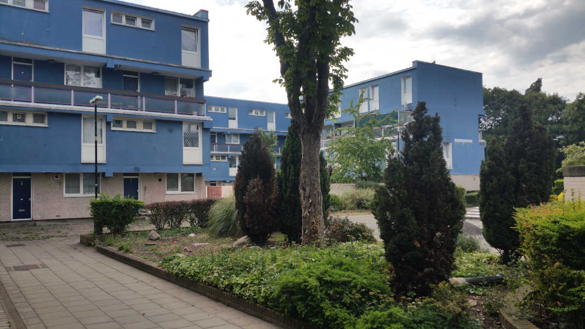

In July 2019, the Mayor approved the demolition of 82 homes on Lambeth's Westbury estate, to provide 270 new homes of which just 38% affordable and only 48 social rent.

All low-rise maisonette blocks on the Westbury estate have been earmarked for demolition as part of Lambeth's ongoing estate renewal programme.

The Mayor's [report](https://www.london.gov.uk/sites/default/files/public%3A//public%3A//PAWS/media_id_469670///westbury_estate_report.pdf) approving the planning permission explains that the scheme couldn't meet his 50% minimum affordable housing requirement because only 38% is viable. 

[Official statistics](https://www.gov.uk/government/uploads/system/uploads/attachment_data/file/674346/LT_116.xlsx) from the government's [live tables](https://www.gov.uk/government/statistical-data-sets/live-tables-on-dwelling-stock-including-vacants) on local authority dwelling stock show that Lambeth has sold or demolished 20,000 council homes in the last 15 years - more than any other London borough.

In November 2019, the Council [resolved](https://moderngov.lambeth.gov.uk/mgIssueHistoryHome.aspx?IId=56827&PlanId=831&RPID=0) to commence compulsory purchase order proceedings in order to remove the 34 leaseholders from the maisonette blocks.

The estate was initially awarded grant funding by the Mayor and exempted from his requirement to ballot residents. In September 2020, the Mayor announced that funding had been [withdrawn from the scheme](https://www.insidehousing.co.uk/news/news/gla-funding-withdrawn-for-three-major-council-estate-regeneration-schemes-68045), but Lambeth vowed to proceed with demolition regardless using its own funds.

In October 2024, Lambeth [announced](https://love.lambeth.gov.uk/lambeth-plans-for-westbury-estate-renewal-progresses/) the completion of 64 social rent homes in the first phase of development. The same press release said that the Council is currently seeking a development partner to help complete the rest of the scheme. 

Lambeth had previously [made the decision](https://www.insidehousing.co.uk/news/london-council-plans-to-deliver-at-least-500-new-homes-by-2030-85865) to shut down its in-house development company (Homes for Lambeth), after a review criticised its “very poor delivery”.

In May 2025, Lambeth Council issued a [press release](https://love.lambeth.gov.uk/lambeth-an-extra-300-new-homes-could-be-added-to-council-estate/) saying that it was looking for a development partner for the remainder of the scheme (having completed just 64 homes in the first phase). 

It also announced that it would be enlaring the scheme to encompass the two high-rise towers on the estate (Amesbury and Durrington Towers).

The announcement was informed by a council report, survey and appraisal study which failed to take into acccount a number of key factors. Read more about these [here](https://estatewatch.london/blog/Westburyestate_blogpost/).

---

__Links:__
[Mayor's stage 1 and 2 reports](https://www.london.gov.uk/sites/default/files/public%3A//public%3A//PAWS/media_id_469670///westbury_estate_report.pdf)

---

<!------------THE CODE BELOW RENDERS THE MAP - DO NOT EDIT! ---------------------------->

---

 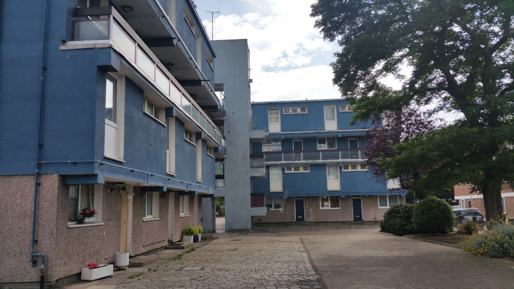
  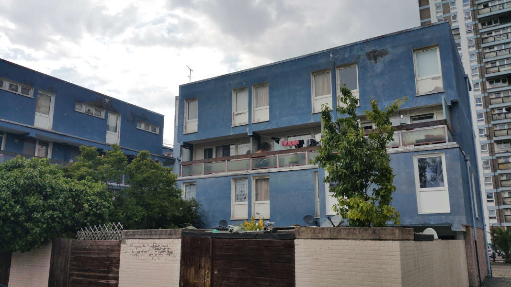
  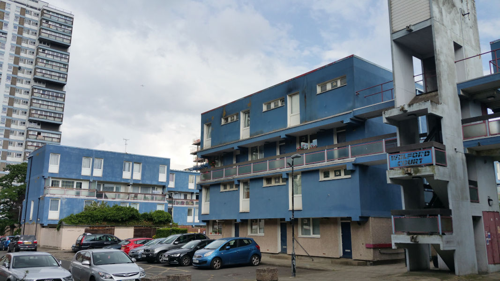
  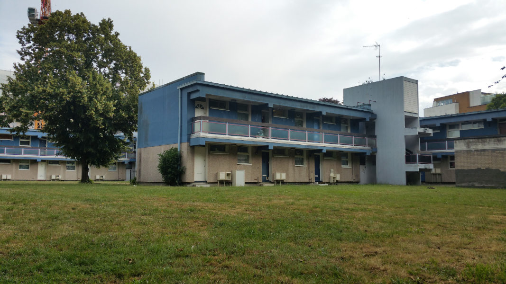
  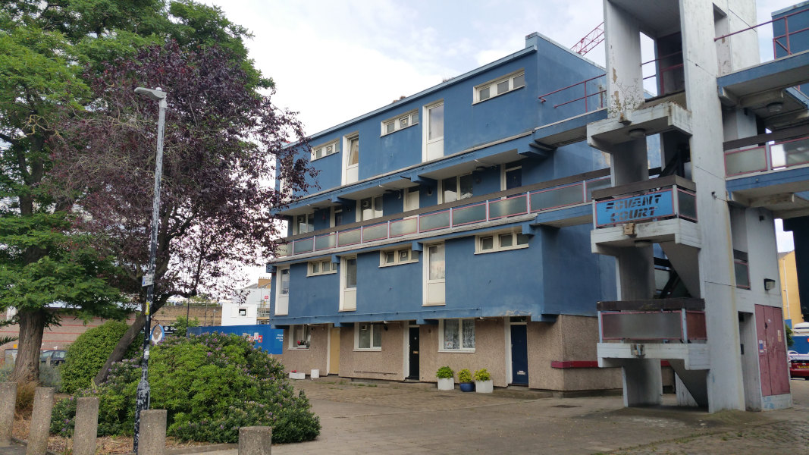
  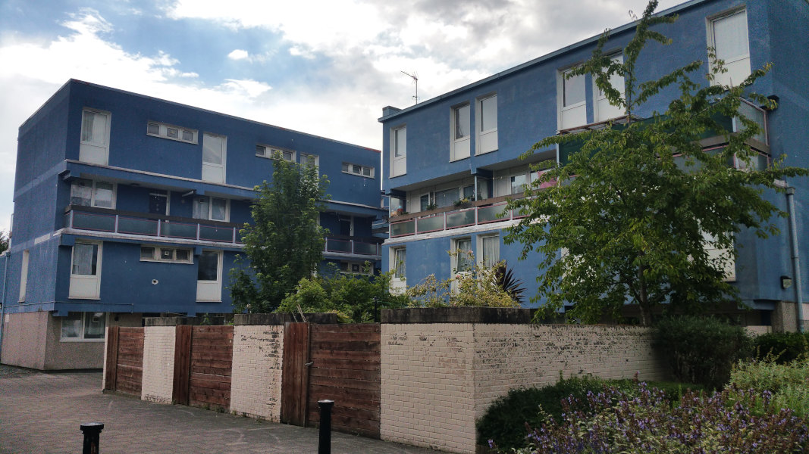
  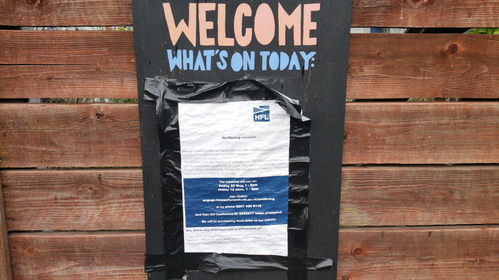
  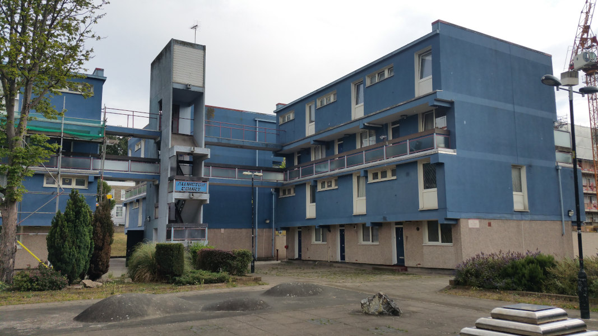
  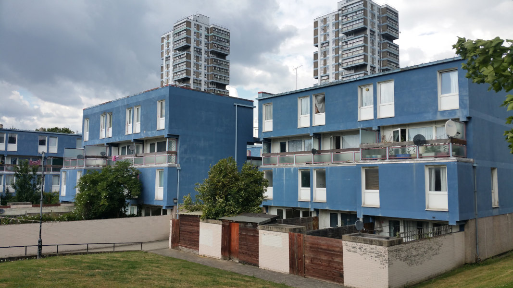
  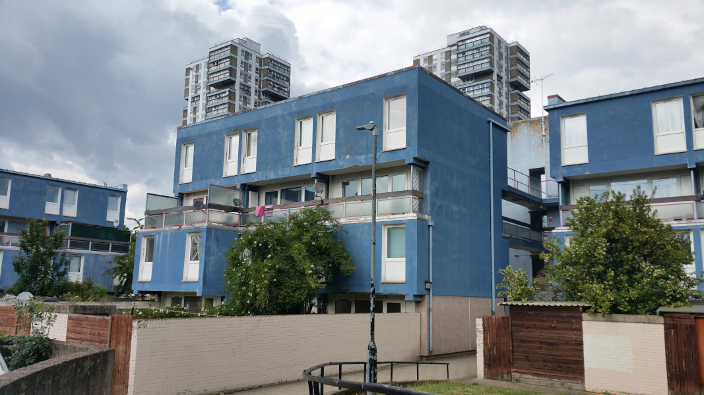

