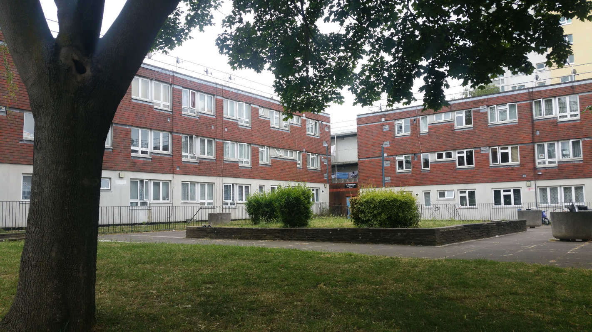

316 homes are earmarked for demolition on Camden's West Kentish Town estate.

In March 2020, residents on Camden's West Kentish Town estate were balloted on the demolition plans for their homes.
Prior to the ballot, residents were [told](/images/wtoffer.pdf) that if they vote against the scheme the their homes wouldn't be brought up to standard for at least another five to ten years: 

---

<!------------THE CODE BELOW RENDERS THE MAP - DO NOT EDIT! ---------------------------->

---

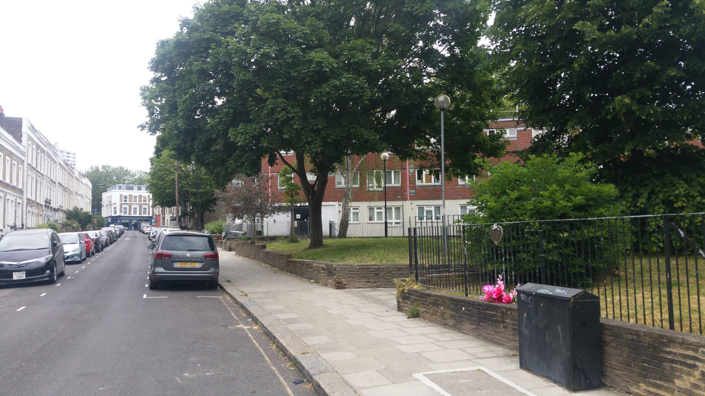
  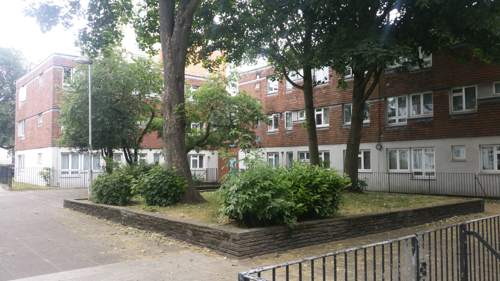
  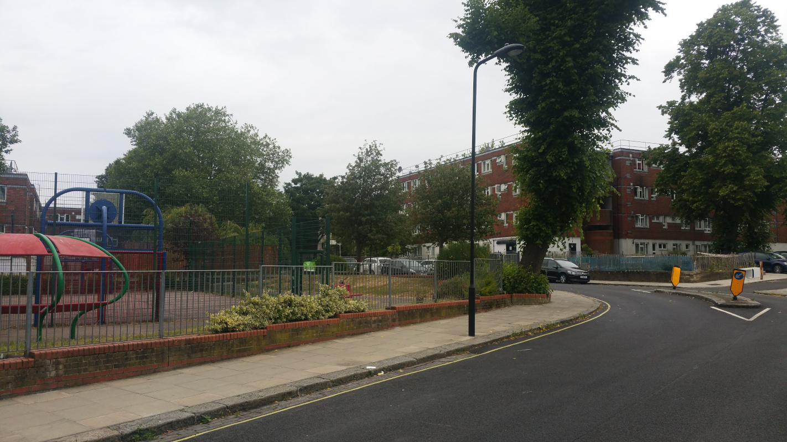
  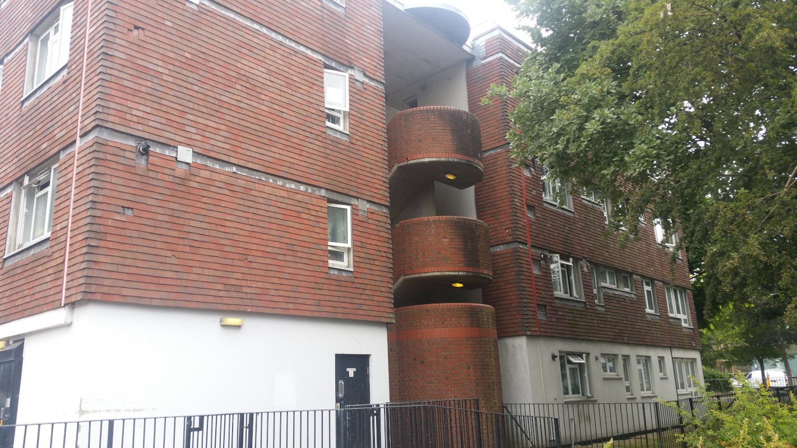
  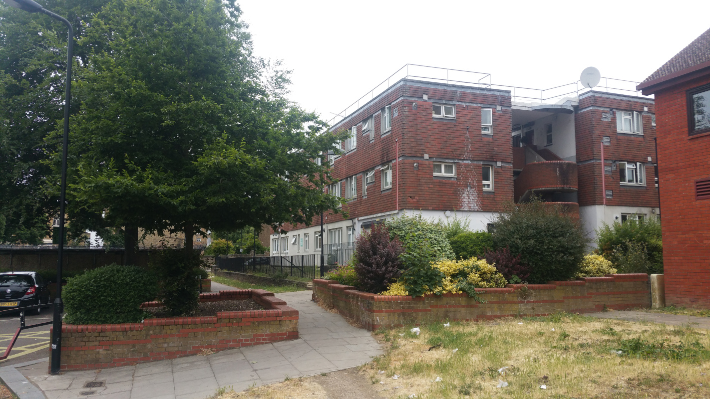
  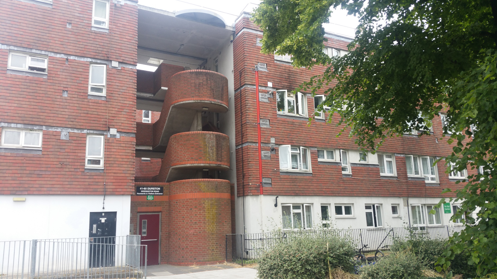
  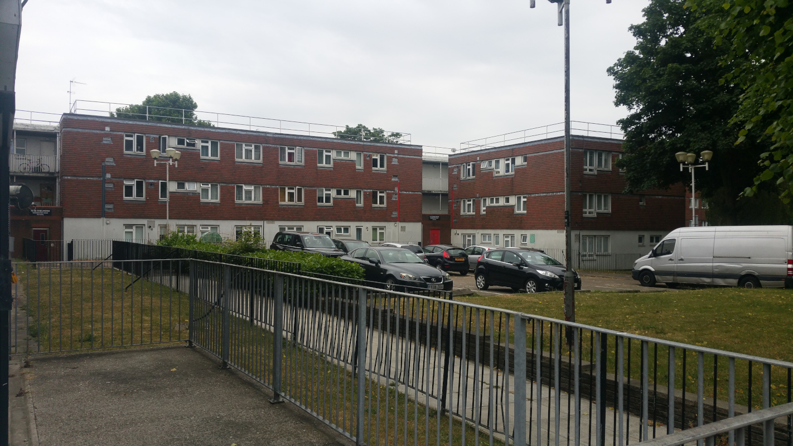
  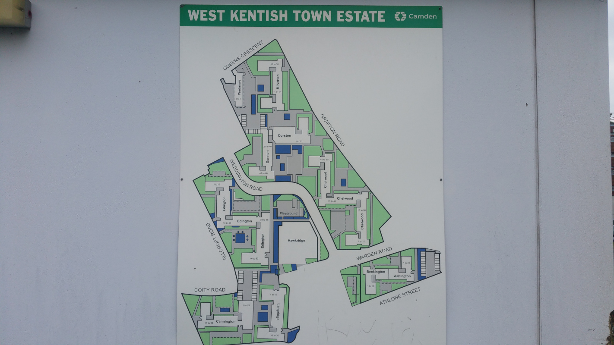
  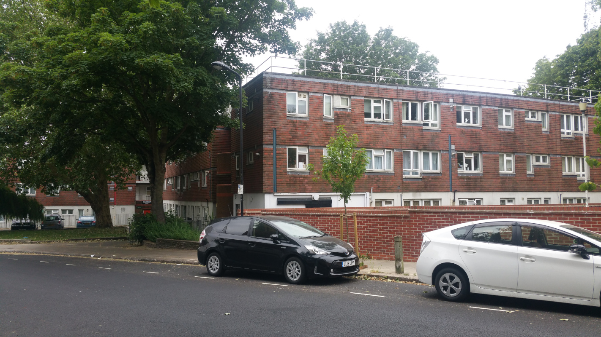
  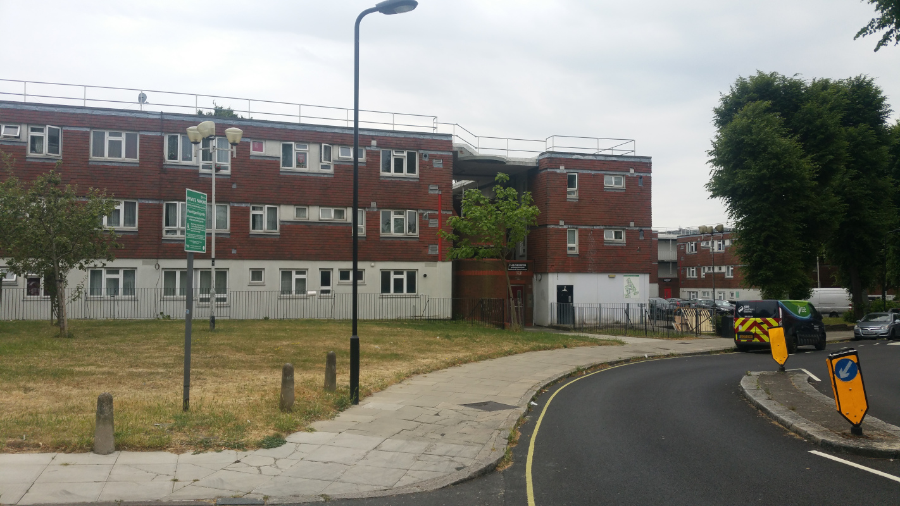
  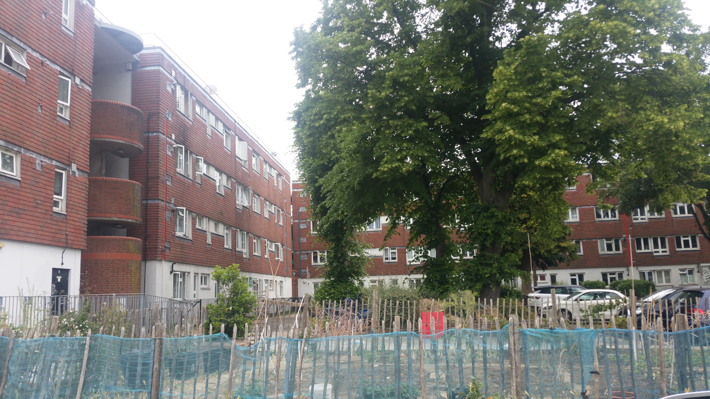
