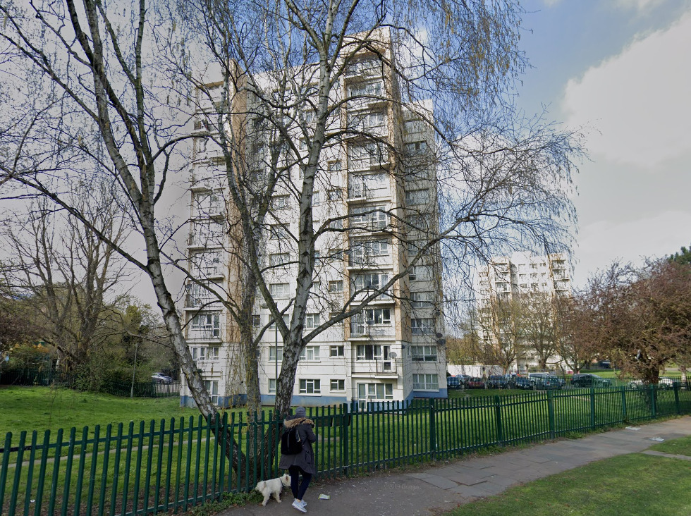

243 homes are earmarked for demolition on Barnet's Whitefield estate in Cricklewood. 

The estate is being demolished and redeveloped as part of the large Brent Cross shopping centre scheme.

The development will see the construction of 7,400 new homes across the entire Brent Cross scheme of which only 15% are secured as 'affordable'. Of the affordable element 60% will be social rent and 40% intermediate housing.

In 2017 Barnet Council was granted the first [compulsory purchase order](/images/whitefieldcpo.pdf) to remove the remaining leaseholders from the first phase.

In May 2023, the decanting of the first phase of the scheme commenced. In April 2024 it was [reported](https://barnetpost.co.uk/2024/04/18/delay-to-transfer-of-estate-residents-into-new-homes-at-brent-cross-redevelopment/) that the first new homes in the first phase of development had been delayed because of issues with the new gas-fired district heating system.

---

**Links:**

Barnet's planning application portal documents and S106 agreement: <https://publicaccess.barnet.gov.uk/online-applications/applicationDetails.do?activeTab=documents&keyVal=ZZZY5NJIXE047>

Mayor's stage 2 report: <https://www.london.gov.uk/sites/default/files/public%3A//public%3A//PAWS/media_id_65975///brent_cross_cricklewood_report.pdf>

2017 Compulsory Purchase Order [inspectors' report](/images/whitefieldcpo.pdf)

---

<!------------THE CODE BELOW RENDERS THE MAP - DO NOT EDIT! ---------------------------->

---