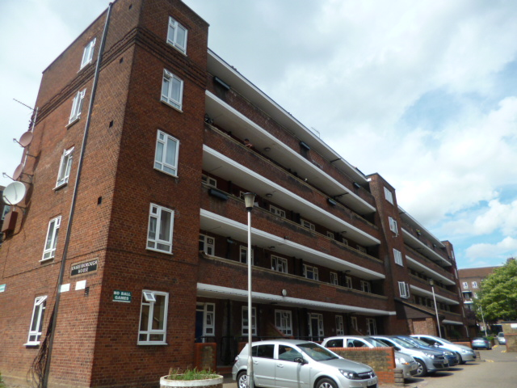
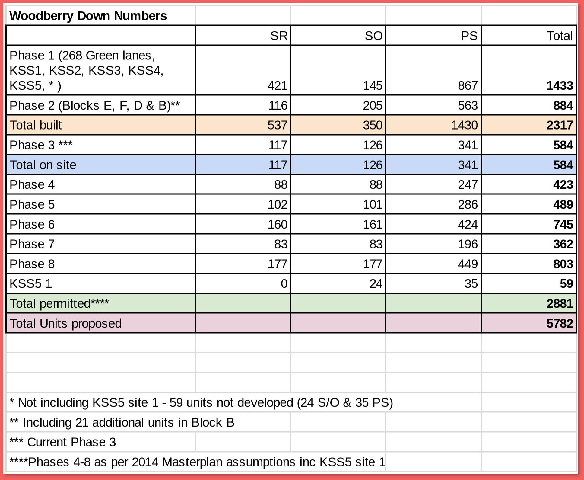

Circa 1,000 homes on Hackney's Woodberry Down estate near Finsbury Park remain under threat of demolition.

Circa 900 homes have already been demolished in the first two phases. Phase 3 of the scheme was granted planning permission in Summer 2019. The scheme proposes to build 5,782 new homes in total over eight phases of development.

The estate has been sold by Hackney Council in a phased conditional agreement to a joint venture between developer Berkeley Homes and Notting Hill Genesis housing association (cf. Aylesbury estate). 

In August 2019, it was [reported](https://www.hackneycitizen.co.uk/2019/08/20/handful-leaseholders-council-plans-woodberry-down-redevelopment/) that _"42 per cent of the homes for private sale in the scheme have gone to overseas buyers, with a predicted net loss by the Town Hall of just over 300 social rented homes."_ and that _"Notting Hill Genesis have been actively seeking to prevent leaseholders taking up shared equity properties in favour of shared ownerships which would yield rental income"_.

The scheme is being [funded](https://www.london.gov.uk/programmes-strategies/housing-and-land/homes-londoners/estate-regeneration/estate-regeneration-data) by the Mayor and [exempted](https://www.london.gov.uk/programmes-strategies/housing-and-land/homes-londoners/estate-regeneration/estate-regeneration-data) from his requirement to ballot residents on the demolition of their homes.

The first 'kick-start' phase one of the scheme was [approved in 2008](https://www.london.gov.uk/what-we-do/planning/planning-applications-and-decisions/planning-application-search/woodberry-down-estate-kick-start-site-one-0).

The 2014 revised master plan including phase 2 (in detailed format) and phases 3 to 8 (in outline) increased the number of housing by 920 units by 2035, for a total of 5,584 total new units, of which:

- 59%, or 3,292 will be private homes
- 41% or 2,265 will be “affordable housing” (with 40% social rent and 60% intermediate housing)

The first phase, along with new retail, open green spaces, a community centre, a park with playground area and a connection with the reservoirs, was completed in 2014. It has delivered 1433 units of which 566 “affordable” (39%), of which 421 for social (housing association) rent, and 145 for shared ownership.

By the end of phase 2, a total of 2,317 new homes have been delivered. The affordable component represents 887 units —of these, 537 are for social (housing association) rent.
In 2020, Hackney Council’s Planning Committee has approved Phase 3, which is currently under construction.

Phase 3 will deliver 584 additional housing units, of which 341 will be market rate (58%) and 243 will be “affordable” (42%, with 117 social (housing association) rent units and 126 shared ownership and shared equity units).

In addition, the development partners are now embarking on another review of the master plan which will impact Phases 5-8. The new figures for units for social rent (SR), shared ownership (SO) and private sale (PS) built, permitted and proposed as of 14 February 2023, provided by Hackney Council (see Table 1.), are as follows:

- Total units permitted (with  phases 4-8 as of Masterplan 2014 assumptions): 2,881
- Total units proposed: 5,872
- Total social (housing association) rent units proposed: 1,264
- Total shared ownership units proposed: 1,110
- Total private sale units proposed: 3,408

A reserved matters application was approved for phase 4 in May 2024. This comprised 511 new dwellings, the majority of these (289) are for private sale, 132 for shared ownership, and just 90 for social rent.

__Tenure Breakdown__ for social rent (SR), shared ownership (SO) and private sale (PS) built, permitted and proposed as of 14 February 2023:

(Figures obtained from Hackney Council, February 2023).

__Retention of residents__  

In 2009, before redevelopment started, there were 2,013 housing units at Woodberry Down: 1,458 council rent, 522 leasehold and 33 private properties which did not belong to the Council (Greater London Authority 2009).

According to the Residents’ Charter signed in 2007, every secure council housing resident has a right to be re-housed in the estate, including leaseholders (which made about 30% of the population before the start of the development) who are offered a share in a new shared ownership unit (Hackney Council, 2007). ​

At the end of the first two phases of redevelopment, 537 council tenant households have been relocated into the new social housing units. Today, the housing blocks north of Seven Sisters Road are home to another 900 households. As of 2022, there were 322 secure council tenants at Woodberry Down still waiting to be re-housed, along with around 416 non-secure temporary tenants and 157 leaseholders (Hackney Cabinet Meeting 2022).

According to the latest figures provided by the Council in February 2023 (see Table 1.), on completion of the redevelopment there will be enough units (1,264) to relocate all existing remaining secure council housing tenants by the end of Phase 5.

However, there will be a net loss of around 190 units for social rent as compared to pre-regeneration numbers.

In May 2024, the fourth phase of the scheme [narrowly won](https://www.hackneycitizen.co.uk/2024/05/15/critics-woodberry-down-plans-next-phase-approval/) detailed planning permission after objections were made to the Council's planning committee. 

[Woodberry Down Community Organisation](https://wdco.org.uk/) voiced the following objection to the Council's planning committee: 

> “144 social homes are being knocked down, and 90 are being built. […] This follows a similar loss in Phase 3, and a loss of 200 social homes from the first to the second masterplan. “We were promised these losses would be made up. Instead, the problem is made worse in Phase 4, and indeed worse in the draft third masterplan.”

---

__Links:__  
[Mayor's planning reports.](https://www.london.gov.uk/what-we-do/planning/planning-applications-and-decisions/planning-application-search?scheme_title=woodberry+down&postcode=&borough=All&planning_authority=All&lpa_case_number=&gla_case_number=&paws_decision_date_from=&paws_decision_date_to=)

The [section 106 agreement](src/images/woodberrys106.pdf)

[Guardian article - 18 May 2014](https://www.theguardian.com/society/2014/may/18/-sp-truth-about-gentrification-how-woodberry-down-became-woodberry-park)

[Hackney's planning application portal documents - ref 2013/3223](http://planning.hackney.gov.uk/Northgate/PlanningExplorer/Generic/StdDetails.aspx?PT=Planning%20Applications%20On-Line&TYPE=PL/PlanningPK.xml&PARAM0=203701&XSLT=/Northgate/PlanningExplorer/SiteFiles/Skins/Hackney/xslt/PL/PLDetails.xslt&FT=Planning%20Application%20Details&PUBLIC=Y&XMLSIDE=/Northgate/PlanningExplorer/SiteFiles/Skins/Hackney/Menus/PL.xml&DAURI=PLANNING)

Municipal Dreams' 2013 blog post on the Woodberry Down regeneration: [https://municipaldreams.wordpress.com/2013/09/17/woodberry-down-hackney-the-estate-of-the-future/](https://municipaldreams.wordpress.com/2013/09/17/woodberry-down-hackney-the-estate-of-the-future/)

Hackney Council. (2007). Woodberry Down residents’ charter. Redraft March. London: Hackney Council.

Hackney Cabinet Meeting. 2022. “Hackney Cabinet Meeting 28 February 2022.”

---

<!------------THE CODE BELOW RENDERS THE MAP - DO NOT EDIT! ---------------------------->

---

__Credits:__
Photos: [Municipal Dreams](municipaldreams.wordpress.com)
Text: Alessandro Busà, University of Leicester
