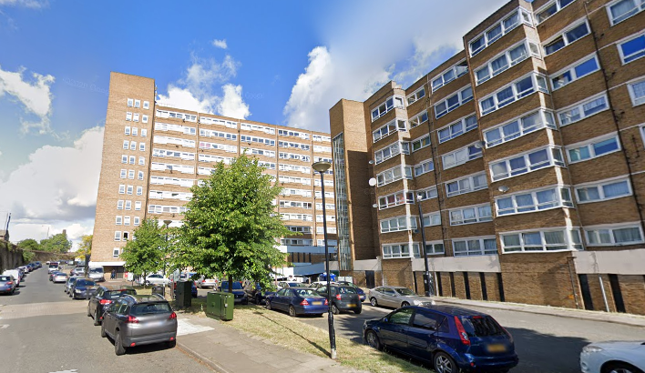
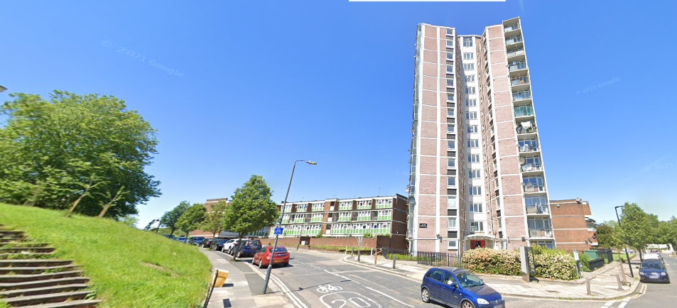
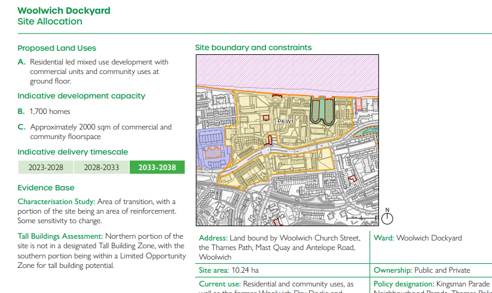

670 council homes have been earmarked for potential redevelopment on the Woolwich Dockyard estate and neighbouring St. Mary's estate in Woolwich.

The estates have been identified for comprehensive redevelopment in Greenwich's [2026 Local Plan](https://committees.royalgreenwich.gov.uk/documents/s17183/12.3%20Appendix%20A%20Part%203.pdf) with the potential to provide 1,700 new homes.

The estates are adjacent to the [Maryon Grove](https://estatewatch.london/limboestates/maryongrove/) and [Morris Walk](https://estatewatch.london/limboestates/morriswalk/) estates, which are both in the process of being redeveloped by Greenwich Council.

Shortly after publishing the site allocation in its draft Local Plan, Greenwich issued a [press release](https://www.royalgreenwich.gov.uk/news/2026/draft-local-plan-and-woolwich-dockyard-area) saying': _"No decision has been made, to bring forward proposals, to redevelop the Woolwich Dockyard and St Marys Estate as part of an estate renewal programme. The Draft Local Plan includes a list of areas where future development to provide new homes could happen and both estates have been included. If any proposals were ever bought forward, residents would be involved from the beginning and no development could go ahead without residents showing support through a ballot."_

---

<!------------THE CODE BELOW RENDERS THE MAP - DO NOT EDIT! ---------------------------->

---