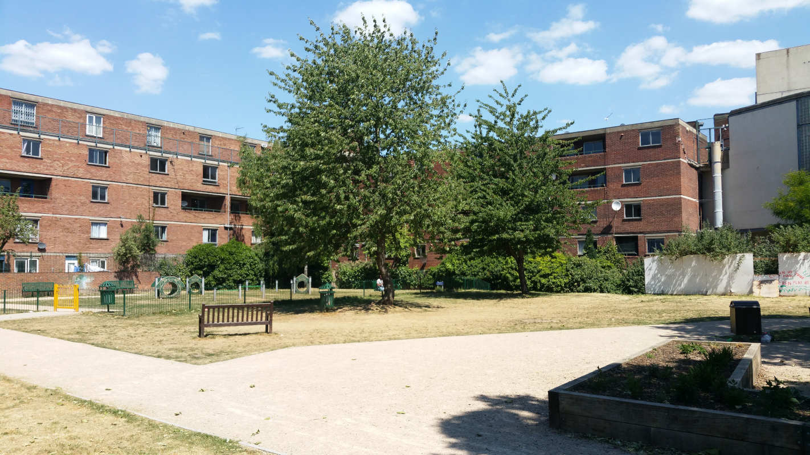
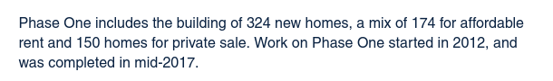
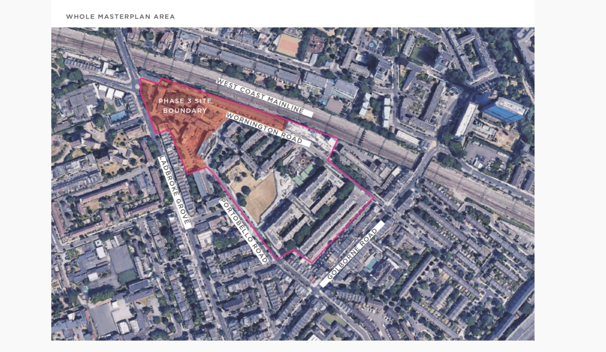

Circa 150 homes on RBKC's Wornington Green estate remain earmarked for demolition by Catalyst Housing Association on phase 3 of its scheme.

The estate's original 538 council homes are being replaced by 1,000 new homes, the precise tenure of which is still unclear.

Catalyst's [website](https://www.chg.org.uk/development-regeneration/regeneration/wornington-green-kensington/) describes the replacement social housing as 'affordable rent':

The Mayor <a href="/approved/funding">approved funding</a> for the scheme in 2017 and <a href="/approved/ballotexemptions">exempted</a> it from his requirement to ballot residents on the demolition of their homes.

Natasha Langridge, a temporary resident on the estate, has directed a [project recording the oral histories of residents](https://worningtonword.renegadetheatre.co.uk/). Here's one of the audio extracts from Keith Stirling - chairman of the Wornington Green Residents Association:

<audio controls style="width: 100%;">
  <source src="https://worningtonword.renegadetheatre.co.uk/sites/default/files/2020-05/13_keith_stirling.mp3" type="audio/mpeg">
</audio>

The full documentary is available for viewing online here: [https://vimeo.com/461591871](https://vimeo.com/461591871)

In September 2022, residents on the final remaining phase of the estate [complained](https://www.mylondon.news/news/west-london-news/life-half-demolished-west-london-25083396) that they had been living on a building site for more than 10 years.

Planning permission for the remaining phase 3 of the scheme is due to be decided in Autumn 2024. Local community activists have set up a website campaigning for more social housing and the retention of trees: <https://www.worningtontrees.com/>

---

__Links:__  

[RBKC's planning application (ref:PP/21/07028)](https://www.rbkc.gov.uk/planning/searches/details.aspx?adv=0&simple=Wornington&simpleBatch=20&simSubmit=Search&id=PP/21/07028&cn=269186+CBRE+UK+Henrietta+House+8+Henrietta+Place+&type=application&tab=tabs-planning-1>)

---

<!------------THE CODE BELOW RENDERS THE MAP - DO NOT EDIT! ---------------------------->

---

