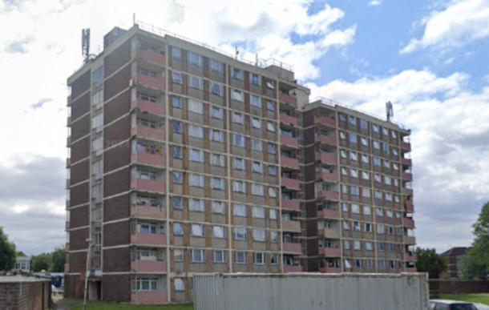
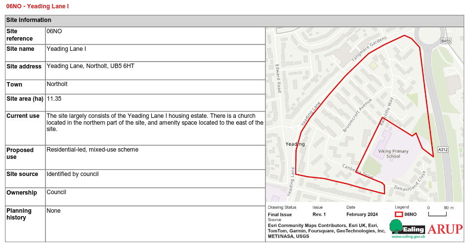

Circa 500 homes at the Yeading Lane 1 estate in Northolt have been earmarked for potential redevelopment in Ealing's [2024 Local Plan](https://www.ealing.gov.uk/download/downloads/id/19587/appendix_e_-_results.pdf).

It is not known if residents have been made aware of the designation. The site allocation states that it _"is a strategic site for Northolt. Although not actively being marketed, there is interest in regeneration of the site, which should come forward within 6-10 years."_

---

<!------------THE CODE BELOW RENDERS THE MAP - DO NOT EDIT! ---------------------------->

---