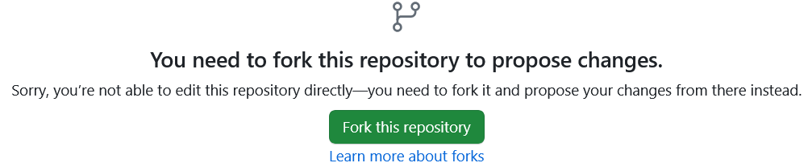
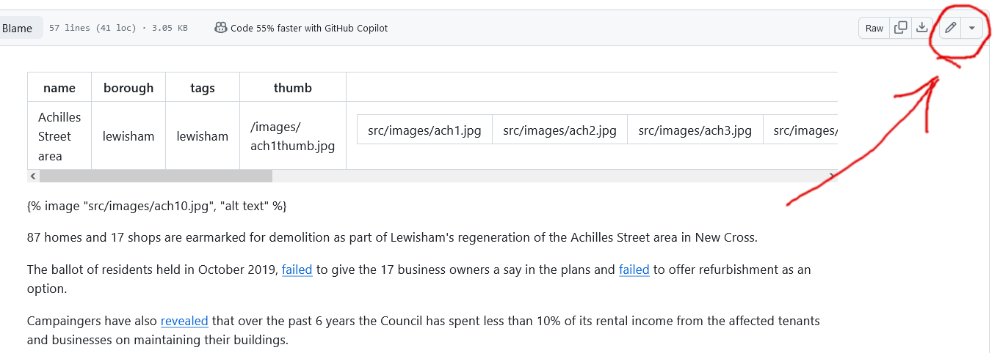

# Github Guide
## How to edit the Estate Watch website


The Estate Watch website uses<a href="https://pages.github.com/"> Github</a> (a web-based platform which facilitates collaborative development of software projects) to store and publish data. The first step to getting involved is to sign up for a (free) github account at <a href="https://github.com/signup"> https://github.com/signup</a>.

<video controls width="100%">
 
  <source src="/images/estatewatchtutorial.mp4" type="video/mp4" />

</video>

To begin editing the Estate Watch website you will first need to be logged in to Github. Next, navigate to the page on the Estate Watch website you want to edit and click the _'edit this page on Github'_ link at the bottom of the page:

<svg xmlns="http://www.w3.org/2000/svg" width="16" height="16" fill="currentColor" class="bi bi-pencil-square" viewBox="0 0 16 16">
  <path d="M15.502 1.94a.5.5 0 0 1 0 .706L14.459 3.69l-2-2L13.502.646a.5.5 0 0 1 .707 0l1.293 1.293zm-1.75 2.456-2-2L4.939 9.21a.5.5 0 0 0-.121.196l-.805 2.414a.25.25 0 0 0 .316.316l2.414-.805a.5.5 0 0 0 .196-.12l6.813-6.814z"/>
  <path fill-rule="evenodd" d="M1 13.5A1.5 1.5 0 0 0 2.5 15h11a1.5 1.5 0 0 0 1.5-1.5v-6a.5.5 0 0 0-1 0v6a.5.5 0 0 1-.5.5h-11a.5.5 0 0 1-.5-.5v-11a.5.5 0 0 1 .5-.5H9a.5.5 0 0 0 0-1H2.5A1.5 1.5 0 0 0 1 2.5z"/>
</svg>
		      <a href="https://github.com/estatewatch/estatewatch/blob/main/{{ page.inputPath }}">Edit this page on GitHub</a>

The first time you click on this link, you will be directed to Github and asked if you want to 'fork' the repository. 

Click the green 'fork this repository' button and you will then be taken to the page you want to edit. 

> **Note:** You will only have to fork the repository once - the first time you make an edit.

Once you have been redirected to the source text page, you will see a page like the one below. Next, click on the pencil icon at the top right of the page to enter editing mode:

Once in editing mode you can edit the text directly or add images and pdf documents, either by dragging and dropping them into the page or copying and pasting them in. You can also use the 'add image' button at the bottom of the page.

This text editor differs from most word processing environments in that it uses 'Markdown' - a lightweight markup language for creating formatted text using a plain-text editor. You can read a short guide on how to use Markdown tags [here](https://docs.github.com/en/get-started/writing-on-github/getting-started-with-writing-and-formatting-on-github/basic-writing-and-formatting-syntax).

This shows for example, how hyperlinks can be inserted by enclosing the linked word in square brackets followed by the URL in parentheses. The shortcut for this is [CTRL + K] - (hold down the CTRL or CMD key and then press k).

When you have finished editing, you can review what they will look like by clicking on the 'Preview' button. Finally, click the green 'Commit Changes' button and then the 'Propose Changes' and then 'Create pull request' buttons. This will submit your changes for review by an administrator before being published.



<b>Please make sure that you don't upload any images that you haven't taken yourself or that you haven't been given permission to use!

In the [Github discussions section](https://github.com/estatewatch/estatewatch.github.io/discussions) you will find a general discussion forum as well as some links and suggestions about how to undertake research on the estates. 

