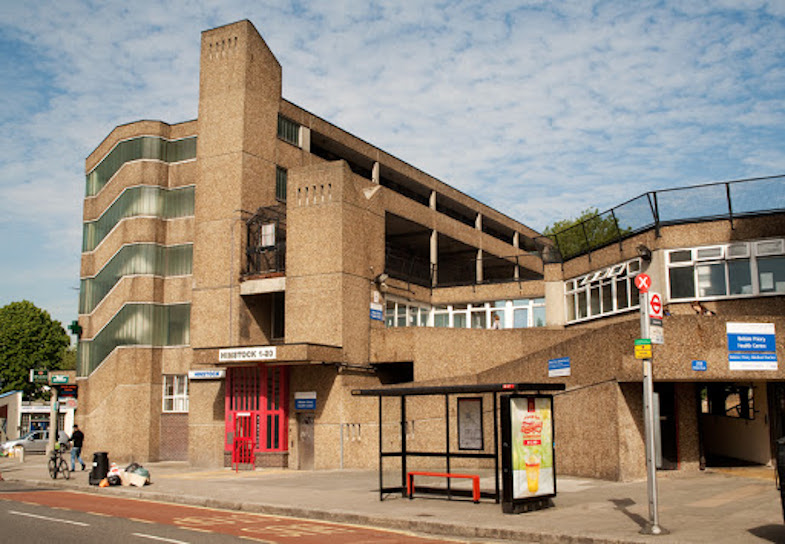
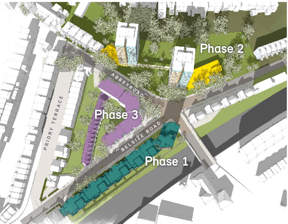
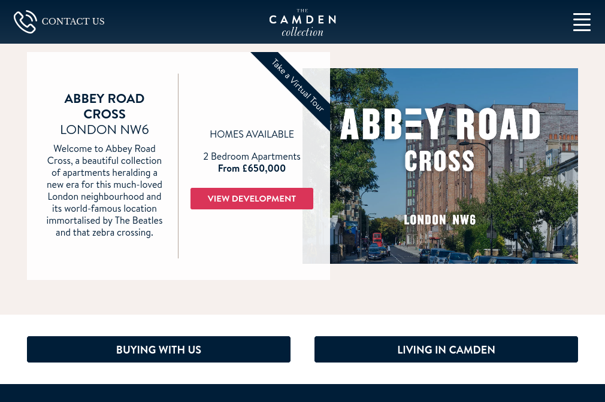
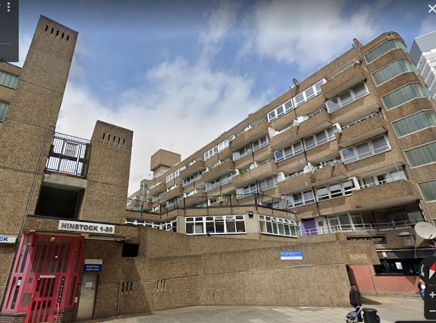
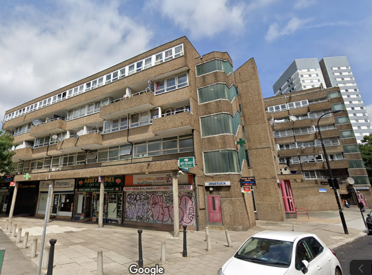

Circa 100 council homes are under threat of demolition in phase 3 of Camden's [Abbey Road estate regeneration](https://www.camden.gov.uk/abbey-road-development), which envisages the demolition of the Emminster and Hinstock blocks.

Phase 3 also involves the demolition of the Abbey Community Centre, Belsize Priory Health Centre, the parade of shops and the Lillie Langtry pub.

Outline planning permission was granted for the scheme in 2013.

Phase 1 of the scheme is already completed and homes are currently being marketed by Camden's in-house marketing group: [https://thecamdencollection.co.uk/private-sale/abbey-road-cross](https://thecamdencollection.co.uk/private-sale/abbey-road-cross) 

The Mayor [approved funding](/approved/funding/) for phase 3 of the scheme in November 2018 and [exempted](/approved/ballotexemptions) it from his requirement to ballot residents on the demolition of their homes. Wates' [website](https://www.wates.co.uk/projects/residential-development/residential/abbey-road-camden/) says that the scheme will provide just 36 council homes.

As of March 2023, phase 2 is nearing completion and phase 3 is awaiting demolition.

---

