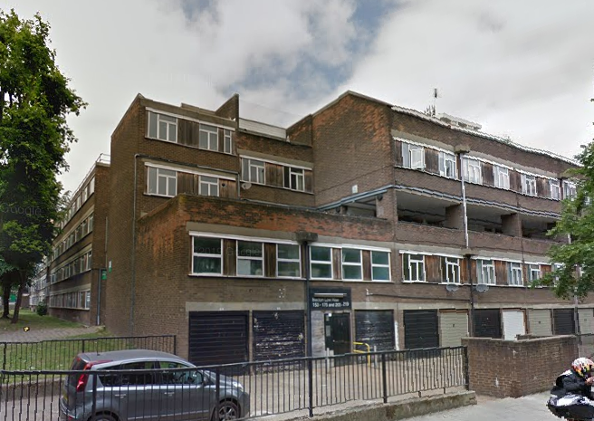
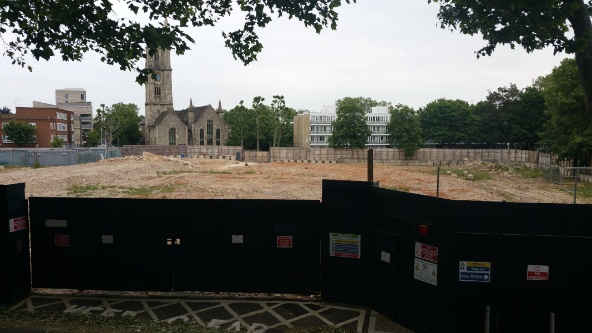

Circa 150 homes have been demolished in the second part of Camden's redevelopment of the Bacton low-rise estate in Gospel Oak.
The estate was decanted in 2014/15 and demolished in 2017. 

The following photograph was taken of the empty site in 2022:

In May 2025, it was [reported](https://www.hamhigh.co.uk/news/25160747.bacton-estate-consultation-mount-anvil-26-storey-towers/) that the developer is consulting on plans to increase the density of its scheme.

