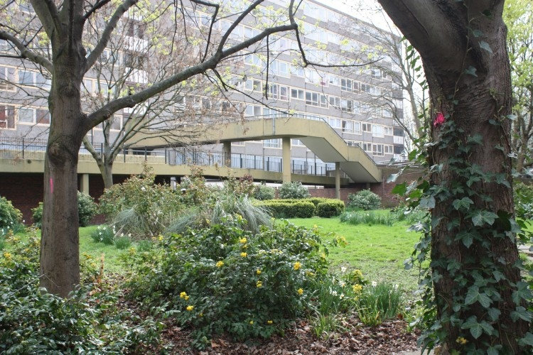
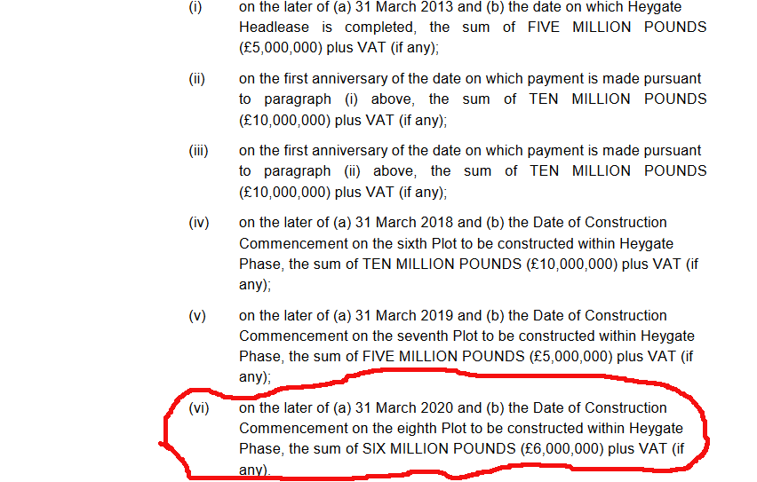

In 2014, demolition started on the Heygate estate's 1,212 council homes. Former council leader Peter John was the driving force behind the estate's redevelopment. He [described](https://web.archive.org/web/20160503113339/https://progressonline.org.uk/2016/01/14/camerons-has-much-to-learn-on-housing/) the Heygate and Aylesbury estates as _“symbols of inner-city neglect, with crime, antisocial behaviour, health inequalities and unemployment the only things that flourished there”_.

The replacement development, Elephant Park will have just 100 social rented homes out of a total of 2,924 new homes (92 out of 2,689 on the main site plus 8 out of 235 on the adjacent first phase of the scheme ['Trafalgar Place'](https://www.elephantpark.co.uk/live-here/to-buy/trafalgar-place/)) 

The Council started 'decanting' the estate in 2006. Council tenants were promised new homes in nearby developments that [never got built](https://www.35percent.org/heygatepages/newhomesforheygate/) and were promised a "Right to Return" to new homes on the redeveloped estate. But the lack of social housing on the new development and the passage of time has rendered this largely useless.  The 180 or so leaseholders had to depend on inadequate compensation to purchase elsewhere and many had to move [out of London](https://35percent.org/2013-06-08-the-heygate-diaspora/) altogether.

In 2013, it was [discovered](https://www.35percent.org/heygatepages/agreementsigned/) that council leader Peter John had sold the entire 10 hectare estate to developer Lendlease for just £50m.

In 2015, it was [found](https://www.theguardian.com/cities/2015/jun/25/london-developers-viability-planning-affordable-social-housing-regeneration-oliver-wainwright) that developer Lendlease had made the scheme appear less viable than it was, in order to reduce the level of affordable housing it was supposed to provide.

In 2017, an investigation by Transparency International - ['Faulty Towers'](https://www.transparency.org.uk/publications/faulty-towers-understanding-the-impact-of-overseas-corruption-on-the-london-property-market/) - found that 'off-plan' sales of new homes, before they were built, was 'dominated' by overseas investors. 

In 2020, council leader Peter John stepped down as leader and [took up a job](https://www.35percent.org/posts/2021-08-05-former-council-leader-slides-through-the-revolving-doors/) with Lendlease's lobbying agent.

In December 2024, the eighth and final phase of the scheme was still an empty building site when developer Lendlease decided to [sell](https://www.costar.com/article/932248710/lendlease-sells-final-plot-at-elephant-castle-regeneration) it to another developer for £42m which is seven times more than the £6m it paid Southwark Council for that plot according to the [partnership agreement](https://southwarknotes.wordpress.com/wp-content/uploads/2013/02/ra.pdf).

You can read more about the Heygate scheme in this [archive](https://www.35percent.org/heygate/) charting the scheme's history.

