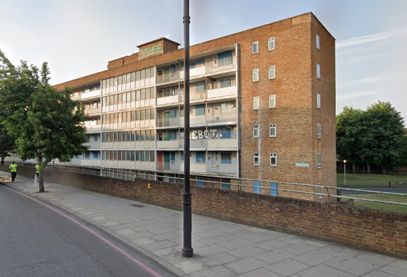
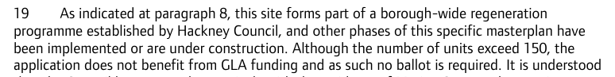
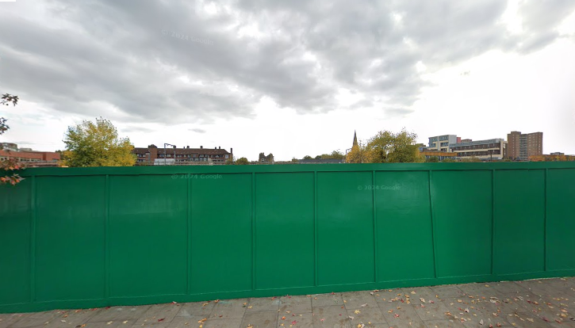
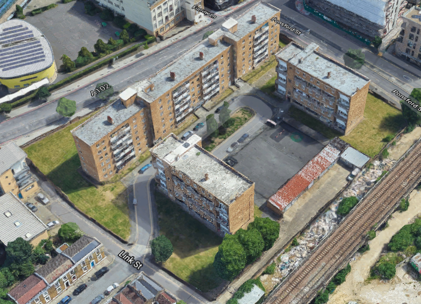
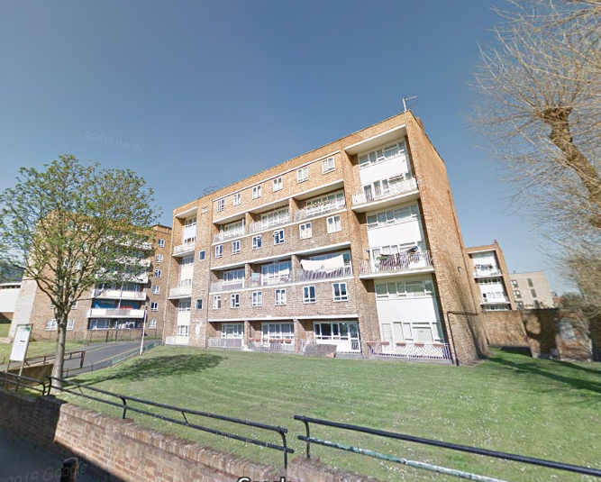
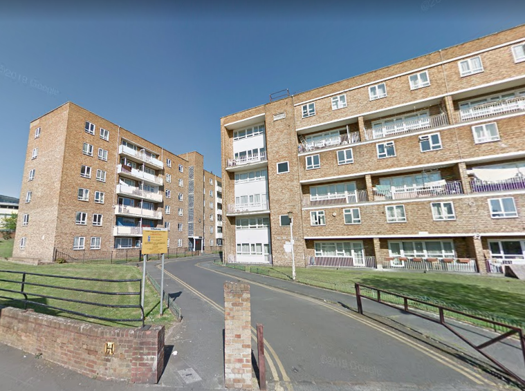
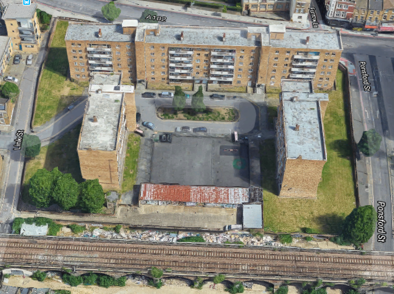
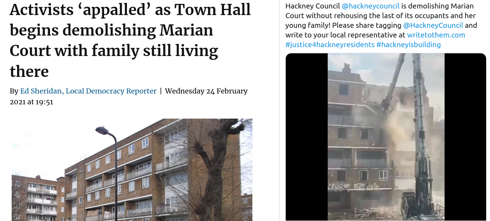

75 homes have been demolished on Hackney's Marian Court estate in Homerton.

Both Marian Court and the adjacent Brige House site were [earmarked for redevelopment](https://hackney.gov.uk/bridge-house) by Hackney Council in a joint venture with developer Austringer Capital. 

The Mayor's May 2018 stage 1 planning report for the scheme says that his ballot requirement is not applicable because Hackney is not seeking grant funding.

However, the scheme is listed in the Mayor's funding register as having been subsequently awarded grant funding in November 2018.

The plans approved the demolition of Marian Court and the construction of 160 new homes, of which 32 social rented.

In February 2021, Hackney Council [came under fire](https://www.hackneycitizen.co.uk/2021/02/24/activists-appalled-town-hall-demolishing-marian-court-family-living/) in February after bulldozers started demolishing the estate with a family still living in one of the blocks. 

Demolition was complete by 2022 and as of November 2024, the site remains a hole in the ground.

Hackney's [website](https://hackney.gov.uk/marian-court) explains that:

> Since the approval of the plans, the cost of building has risen significantly. This is due to:

* increasing price of labour and materials – caused by multiple factors such as Brexit
* COVID-19
* rising energy costs

> There have also been some significant changes introduced to building safety regulations. These include enhanced fire safety requirements. We will work on updating the designs to ensure they meet the new regulations without reducing design quality. Due to the number of steps that we must complete, we expect that the earliest main works can begin in spring 2025.

---

  
  
  
  
  

