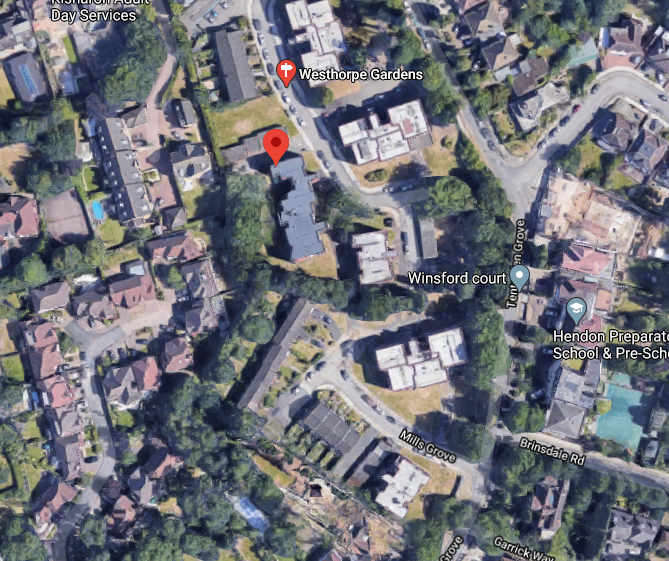
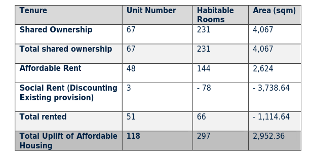
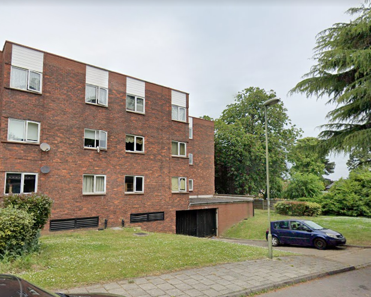
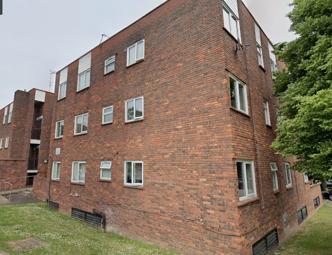
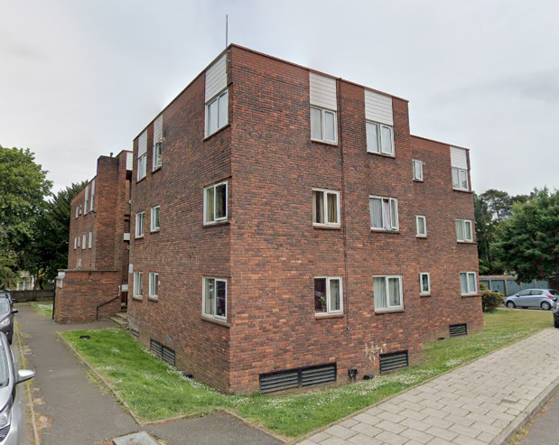

102 homes on Barnet's Mills Grove and Westhorpe estate have been demolished.

In November 2018 Landlord Metropolitan Housing Association balloted residents on the redevelopment of the estate. 66% of eligible residents voted, with 75% voting in favour.

In June 2019, the Mayor gave provisional approval to the demolition of 102 homes on the two neighbouring estates. The Mayor's [report](https://www.london.gov.uk/sites/default/files/PAWS/media_id_464602/westthrope_gardens_and_mill_grove_estate_report.pdf) says that the scheme complies with his minimum 50% affordable housing requirement and that there will be no net loss of social rented accommodation.

The [planning documents](https://publicaccess.barnet.gov.uk/online-applications/files/DB1BCDA5BA11ED66C650A0ECAAA014EE/pdf/18_7495_FUL-AFFORDABLE_HOUSING_STATEMENT_FV-4303171.pdf) show that while there will be a net increase of 3 social rented homes, there will be a net loss of 3,738 square metres of social rented floorspace because the replacement homes will be smaller.

There is no publicly available section 106 agreement on [Barnet's planning portal](https://publicaccess.barnet.gov.uk/online-applications/applicationDetails.do?activeTab=documents&keyVal=PJZA9IJI09W00) so it is impossible to confirm whether the replacement 'social' housing has been secured as social rent in perpetuity or affordable rent (up to 80% market rent).

As of November 2024, the first phase of construction had been completed and the second phase was underway.

---

__Links:__  
[Metropolitan Housing Association's website](https://www.metropolitan.org.uk/for-customers/westhorpe-gardens-mills-grove/)

---

---

<!------------THE CODE BELOW RENDERS THE MAP - DO NOT EDIT! ---------------------------->

---