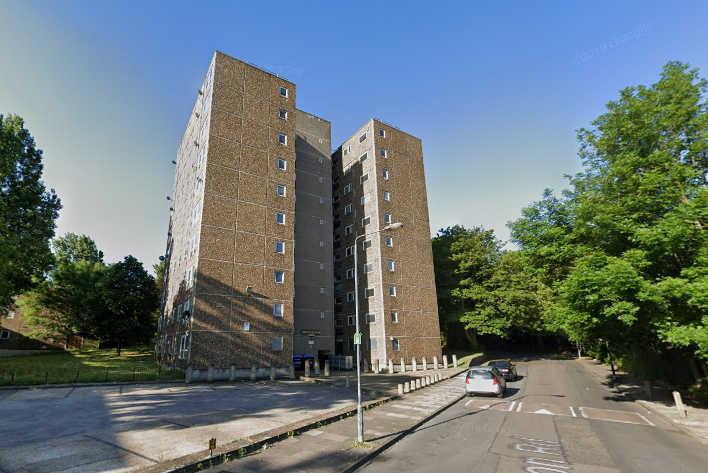
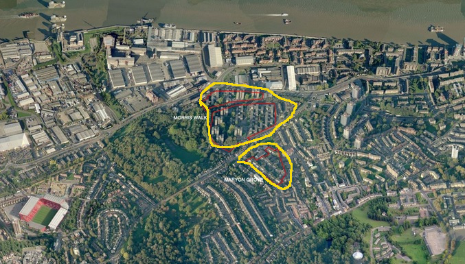
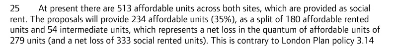
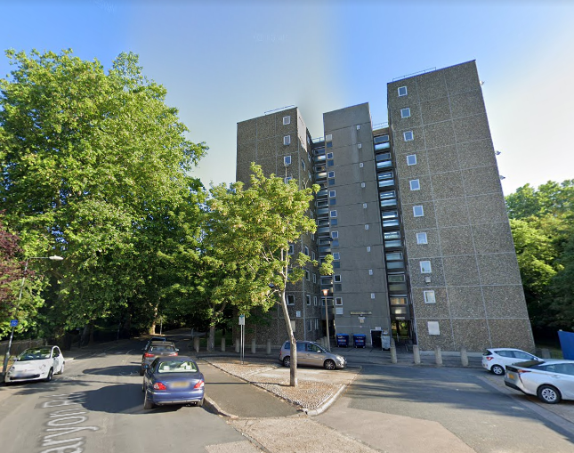
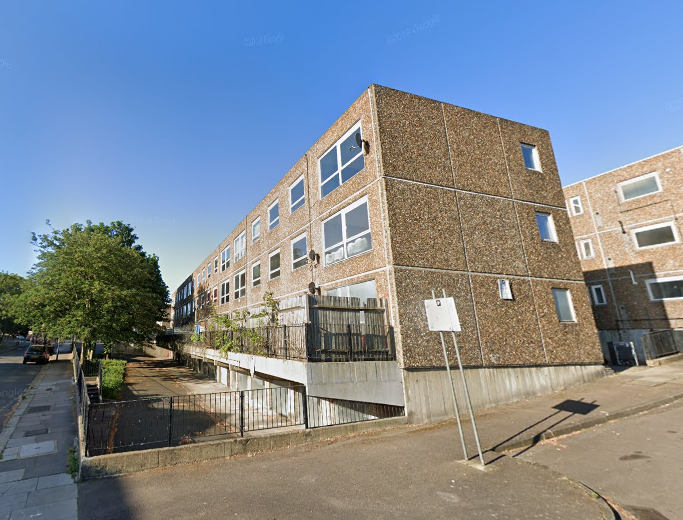
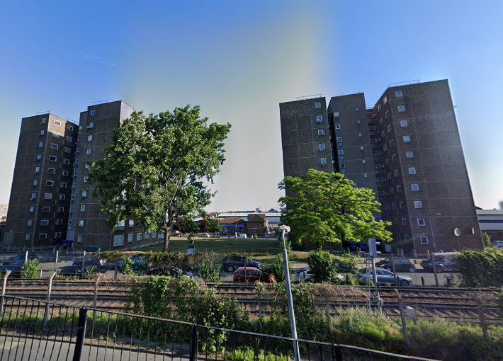

562 homes on Greenwich's Morris Walk estate in Charlton have been demolished. 

The 5.5 hectare estate overlooked Maryon park to the West and the Thames barrier to the North and lies adjacent to the [Maryon Grove estate](https://www.estatewatch.london/estates/greenwich/maryongrove/), which is also earmarked for redevelopment. 

Outline permission granted in 2015 for 766 replacement homes, with the requirement to provide between 35% and 45% affordable housing, depending on viability. The estate is being redeveloped in a joint venture between Greenwich Council and developer [Lovell](https://www.lovell.co.uk/)

The Mayors [report](https://www.london.gov.uk/sites/default/files/public%3A//public%3A//PAWS/media_id_251858///one_woolwich_morris_walk_report.pdf) approving the application acknowledges that there will be a net loss of 333 social rented units.

It also acknowledges that the replacement 'social' housing will be 'affordable rent' in tenure - i.e. up to 80% market rents.

In January 2018, the Mayor [approved funding](https://www.london.gov.uk/sites/default/files/2021.03.18._estate_regen_projects_approved_before_18_july_2018_march_2021.pdf) for the redevelopment of the estate.

In July 2019, Greenwich approved a decision to start compulsory purchase proceedings against the remaining leaseholders on the estate. 

In November 2020, Lovell submit a planning application for detailed permission. It proposed 766 new homes, 177 of which at affordable rent - there won't be a single social rented home to replace those demolished. It is unclear from the planning application documents what percentage of market rent the 177 affordable rent homes will be provided at. The tenure category in general allows rents of up to 80% market rent.

The 177 affordable rent homes will be accompanied by 76 for shared ownership, bringing the total proportion of affordable housing to 35% - well below the Mayor's minimum requirement of 50% affordable housing on public land.

Despite the Mayor's policy requirement that viability assessments be made public, none has been made available on Greenwich's planning portal. The planning application was approved by Greenwich Council's planning committee in December 2021.

You can view the planning application documents on Greenwich Council's planning portal [here (refs: 20/3403/R and 20/3445/R).](https://planning.royalgreenwich.gov.uk/online-applications/applicationDetails.do?activeTab=documents&keyVal=_GRNW_DCAPR_104919)

Leaseholders wanting to take up a new home on the redeveloped estate will have to do so under a shared-ownership agreement - ie. paying rent on the unowned proportion. 

The estate [lay empty](https://www.fromthemurkydepths.co.uk/2020/04/14/woolwichs-morris-walk-estate-in-its-final-days/) for several years before it was demolished in 2021.

As of November 2024, the first small phase of redevelopment is underway on the North-east corner of the estate, whilst the rest of the site remains empty and boarded up.

---

__Links:__

[Outline planning application docs (North side)](https://planning.royalgreenwich.gov.uk/online-applications/applicationDetails.do?activeTab=documents&keyVal=_GRNW_DCAPR_76330)

[Outline planning application (South side)](https://planning.royalgreenwich.gov.uk/online-applications/applicationDetails.do?activeTab=documents&keyVal=_GRNW_DCAPR_76329)

[GLA Stage 1 and 2 reports](https://www.london.gov.uk/sites/default/files/public%3A//public%3A//PAWS/media_id_251858///one_woolwich_morris_walk_report.pdf)

---

---

<!------------THE CODE BELOW RENDERS THE MAP - DO NOT EDIT! ---------------------------->

---