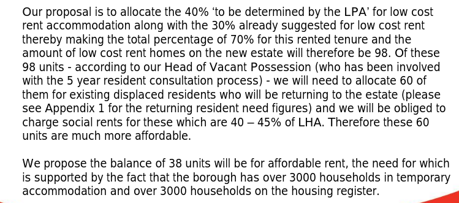
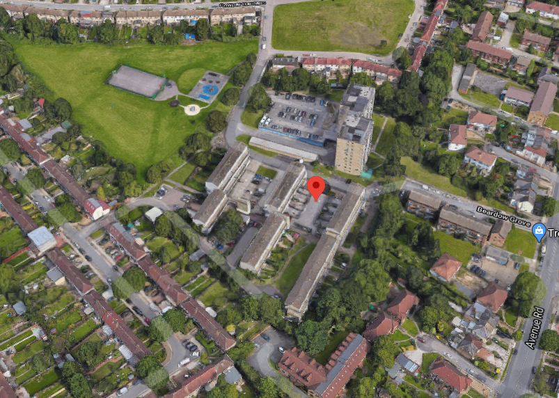

In April 2018, the Mayor approved the demolition of 171 homes on Enfield's New Avenue estate with just 60 replacement properties at social rent.

Enfield Council signed a joint-venture agreement with developer Countryside Properties for the redevelopment of the estate in 2015.

Phase one of the three phase scheme has been demolished and is nearing completion. Remaining phases are still occupied but in the process of beeing 'decanted'.

In December 2017 Enfield [set out its intention](/images/newavenuesr.pdf) to provide just 60 social rented replacement units, the remainder of the 'affordable housing' being for affordable rent (up to 80% market rent) or intermediate affordable.

Despite being [funded](/approval/funding) by the Mayor and exempted from his [ballot requirements](/approved/ballotrequirements). In April 2018 the Mayor signed off the planning permission granting the construction of 408 new homes of which only 34% will be 'affordable'. The Mayor's minimum policy requirement is 50% in estate regeneration schemes. The Mayor's report says that it was able to increase the number of social rented homes to 129. But the section 106 agreement is not publicly available on Enfield's planning portal so it is not clear whether these have been secured as social rent or affordable rent (up to 80% market rent).

Countryside have started [marketing](https://www.countrysideproperties.com/all-developments/london/new-avenue) new phase 1 homes off-plan on the redeveloped estate for prices starting at £600k.

There is no provision on the redeveloped estate for the estate's 40 leaseholders. Enfield has no shared equity scheme - if leaseholders want to buy one of the new shared ownership homes they will have to qualify for eligibility and pay rent on the unowned equity.

Set to be delivered in three phases, work is currently underway to complete the second phase. In 2021, the first phase was completed with 127 homes, of which 71 are affordable rent (up to 80% market rent).

In February 2025, it was [reported](https://enfielddispatch.co.uk/move-to-provide-more-social-rent-homes-on-southgate-estate-redevelopment/) that Enfield Council will help unlock the third phase which was stalled due to viability issues and redesign requirements due to new fire safety requirements.

The council says it is negotiating with Countryside on the acquisition of 159 new homes previously earmarked for private sale, with plans to convert them into social-rent homes. This would be funded with an additional grant from the Mayor's Affordable Homes Programme (AHP).

---

__Links:__

Enfield's [planning application documents](https://planningandbuildingcontrol.enfield.gov.uk/online-applications/applicationDetails.do?activeTab=documents&keyVal=O5KV2MJN04Y00)

The Mayor's [stage 1 and stage 2 reports](https://www.london.gov.uk/sites/default/files/public%3A//public%3A//PAWS/media_id_394835///new_avenue_estate_report.pdf) (April 2018)

---

