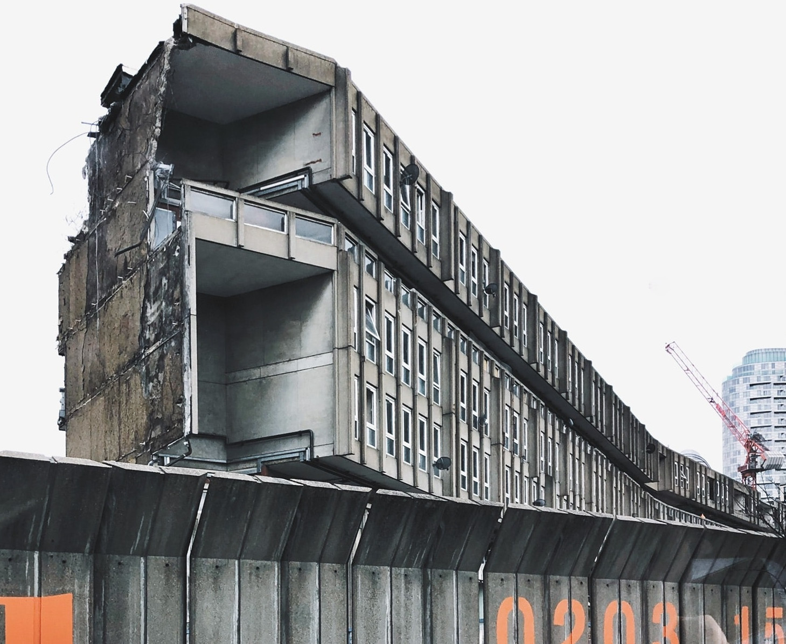

The remaining half of the Robin Hood Gardens estate in Poplar is earmarked for demolition.

A 2006 survey found the blocks to be ‘in poor condition’ with significant defects to the external envelope and roof coverings. It recommended the replacement of existing bathrooms and kitchens and identified problems with electrical wiring and other services. A 2007 study concluded it would cost £70,000 per flat to bring them up to the Government’s Decent Homes Standard. In 2008, Tower Hamlets Council had voted for its demolition.

A petition to have the estate listed was signed by architects such as Richard Rogers, Toyo Ito and the late Zaha Hadid but ultimately failed.

The scheme forms part of a five-phase regeneration project, aiming to create a total of 1,575 new homes, 566 social rent and 132 intermediate. 

The [planning application](https://development.towerhamlets.gov.uk/online-applications/applicationDetails.do?activeTab=documents&keyVal=DCAPR_101615) was approved in 2012.

The first phase where the western block was demolished was completed in 2015.

The eastern block has been emptied and is due to be demolished as part of the next phase of the scheme. As of July 2024, it was [reported](https://poplarlondon.co.uk/streets-sky-utopian-social-housing-robin-hood-gardens-balfron-tower/) to be still standing.

---

__Links:__

Planning application documents: [https://development.towerhamlets.gov.uk/online-applications/applicationDetails.do?activeTab=documents&keyVal=DCAPR_101615](https://development.towerhamlets.gov.uk/online-applications/applicationDetails.do?activeTab=documents&keyVal=DCAPR_101615)

---

<!------------THE CODE BELOW RENDERS THE MAP - DO NOT EDIT! ---------------------------->

---

