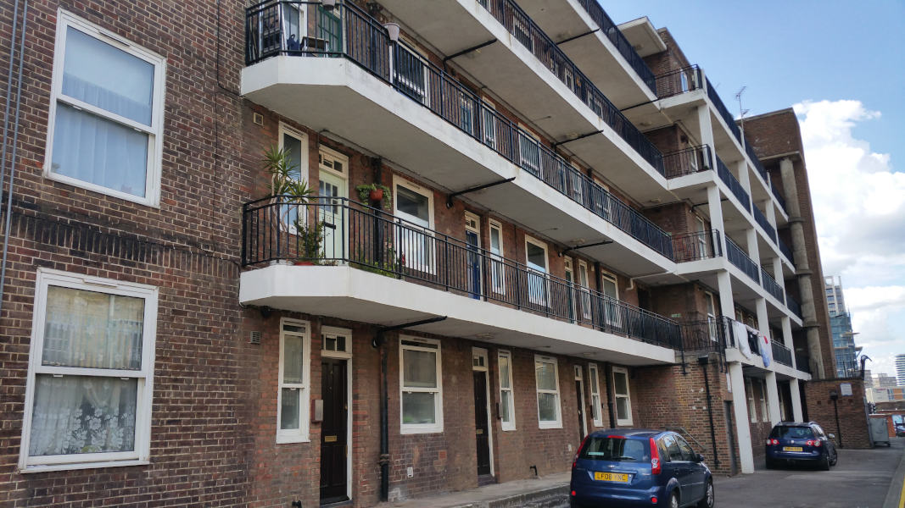
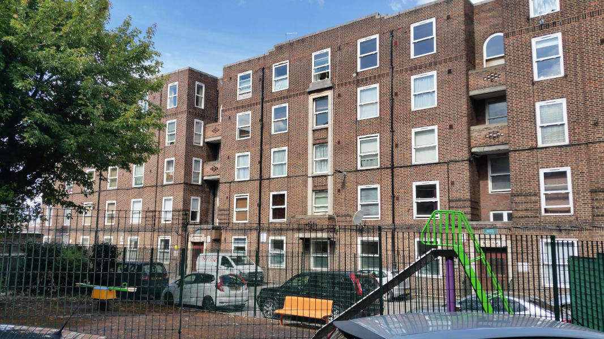
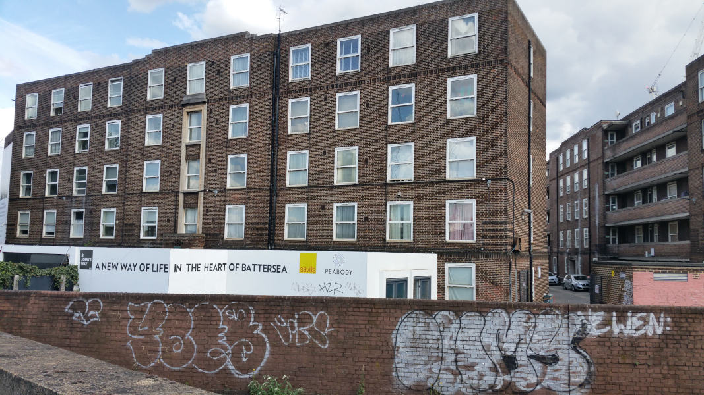
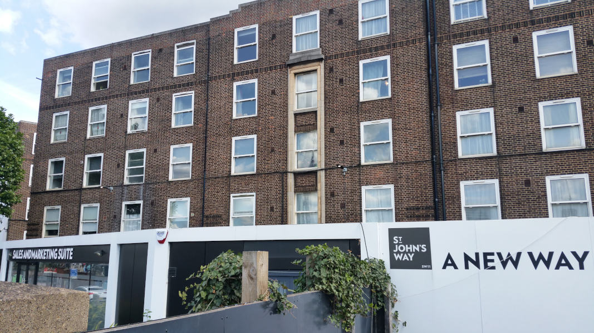
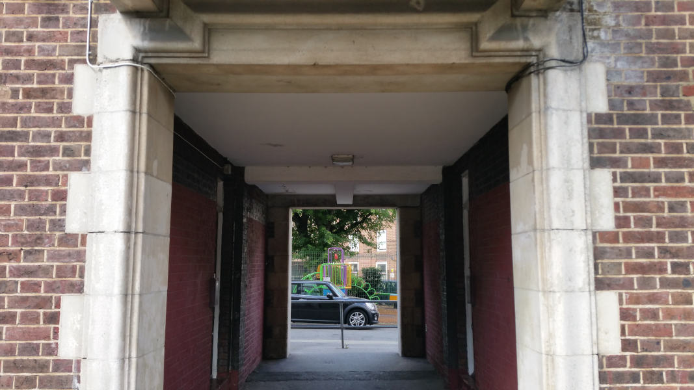
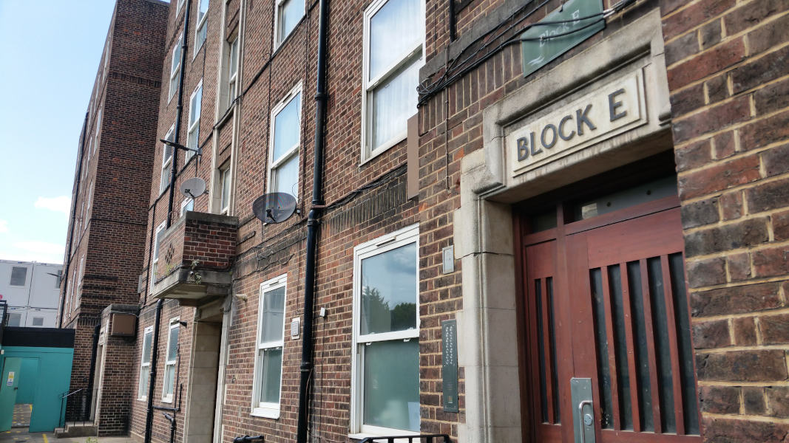
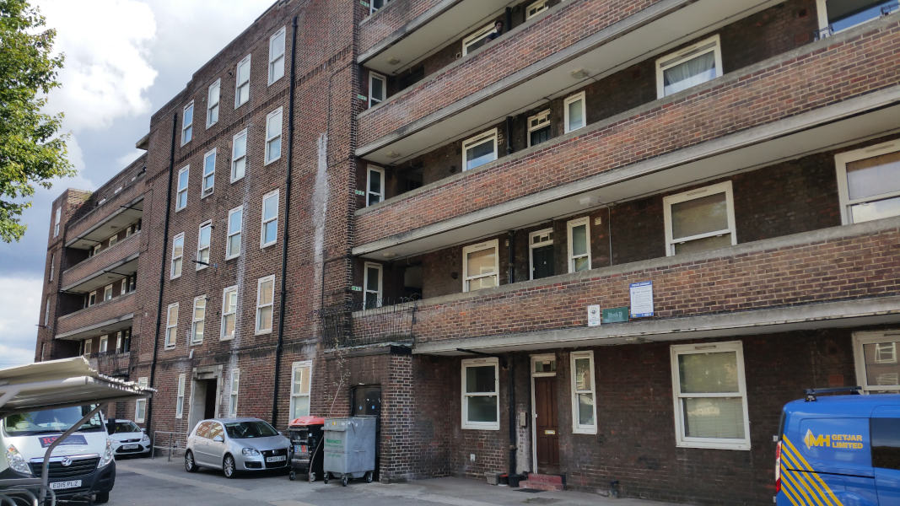
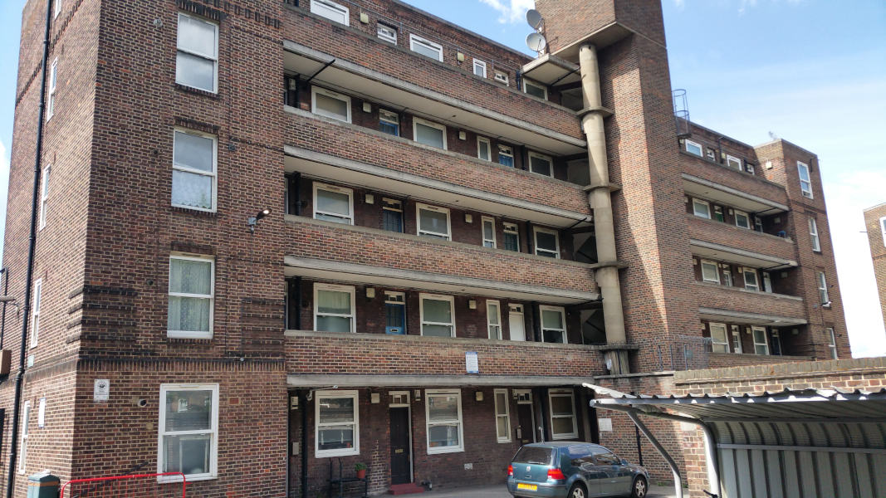

158 homes have been demolished in Peabody's redevelopment of the St John's Hill estate near Clapham Junction.

As at February 2022, phases 1 and 2 were underway but the remaining phase 3 was still fully occupied.

The estate was originally designated for redevelopment in Wandsworth's [2016 Local Plan](https://www.wandsworth.gov.uk/media/1937/sd_021_site_specific_sites_allocations_document__2016_.pdf).

Planning permission was originally granted in 2012, but a revised application was approved in September 2018, which enabled the construction of 599 new homes of which 315 affordable (236 social rent, 7 affordable rent and 72 intermediate).

The scheme was exempted by the Mayor from his requirement to ballot residents on the demolition of their homes.

As at June 2025, the final phase 3 of the scheme was still under construction - several years behind schedule.

---

__Links:__ 

Mayor's stage 2 report - [https://gla.force.com/pr/s/planning-application/a0i4J0000003U0fQAE/20182253bs2?tabset-c2f3b=2](https://gla.force.com/pr/s/planning-application/a0i4J0000003U0fQAE/20182253bs2?tabset-c2f3b=2)

Peabody's website - [https://www.peabody.org.uk/homes-in-development/wandsworth/st-johns-hill](https://www.peabody.org.uk/homes-in-development/wandsworth/st-johns-hill)

---

  
  
  
  
  
  
  