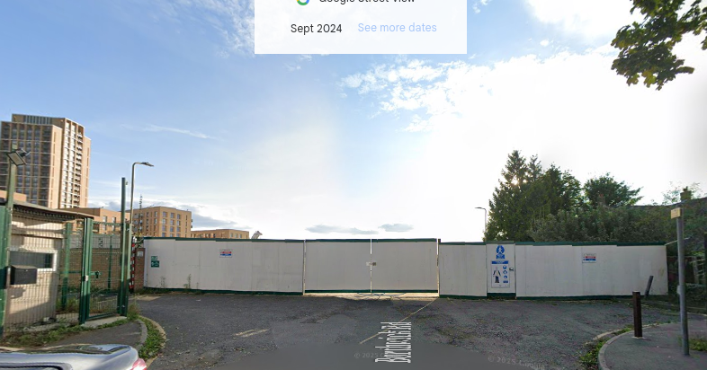

Around three quarters of a total of 680 homes have been demolished on the West Hendon estate in Barnet.

Phases 1-2 have of this six-phase scheme have been completed under earlier planning permissions (2007 and 2008). Phase 3 (with both outline and detailed elements in the hybrid) has been completed, and Phase 4 was commenced in 2023.

In 2017, detailed permission was granted for the final Phases 5 and 6 but appear to have since stalled. As of September 2024 these phases remain an empty building site.

---

<!------------THE CODE BELOW RENDERS THE MAP - DO NOT EDIT! ---------------------------->

---