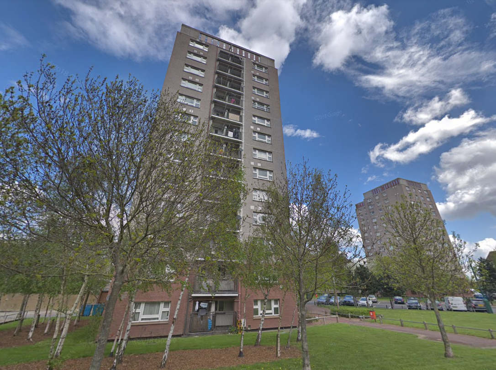
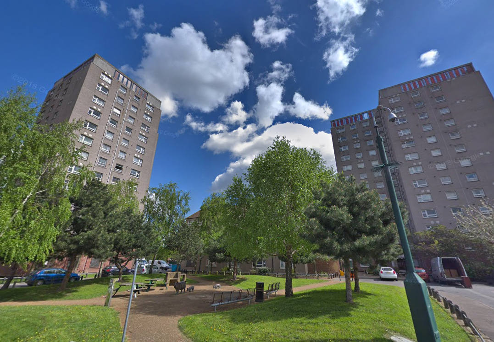
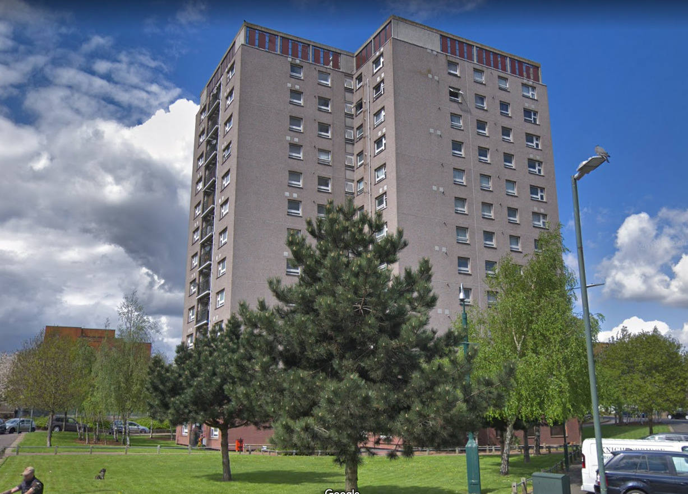
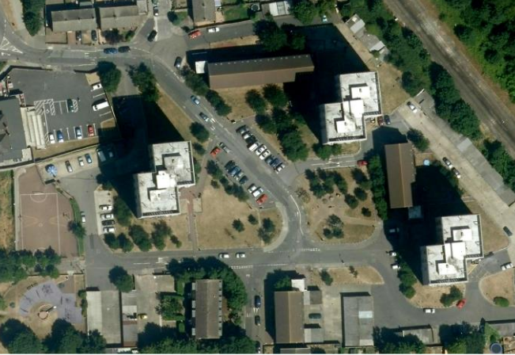
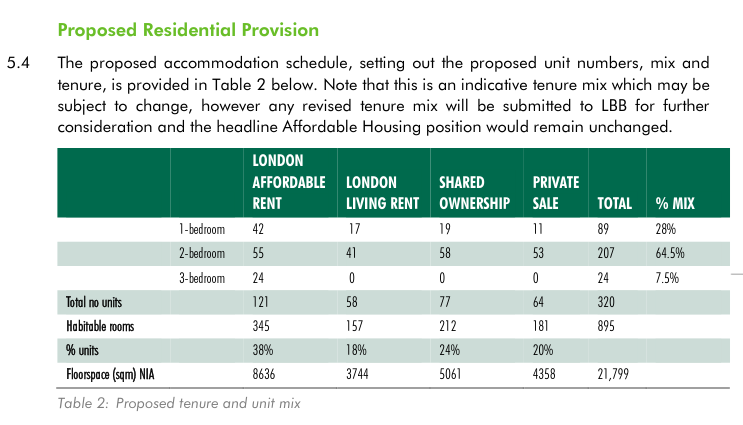
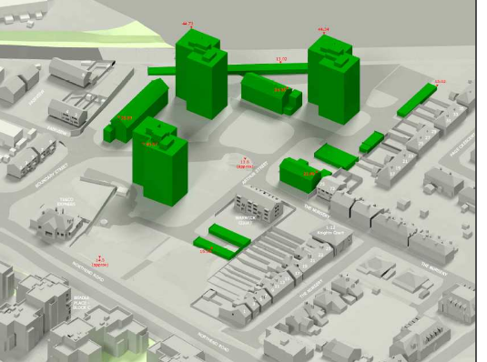
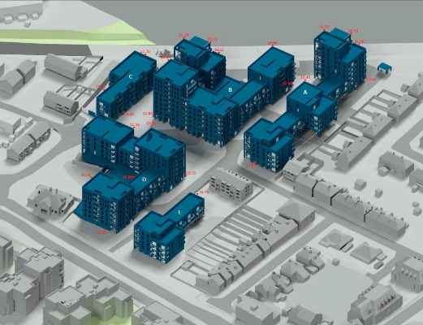

--- 
name: Arthur Street estate 
borough: bexley
image: estates/src/images/ats1.jpg
location: '[51.473006,0.183563]'
landlord: Orbit (Housing Association)
developer: Wates
itla:
total: 262
ballot: Exempt
planning: Approved
---

In Sep 2019, the Mayor approved the demolition of 262 homes on Bexley's Arthur Street estate - to be replaced by 320, all social rent being replaced by London Affordable Rent, at a net loss of 134 ‘social’ homes

The Mayor's [planning report](https://www.london.gov.uk/sites/default/files/public%3A//public%3A//PAWS/media_id_473856///arthur_street_estate_report.pdf) approving the scheme, accepts the justification made for the net loss which is that affordable housing is being built on other sites in the borough. 

The scheme is being progressed with Mayoral funding by Orbit Housing Associationand is one of 44 estates that the Mayor has [exempted from the requirement to ballot residents on the demolition of their homes](https://estatewatch.london/approved/ballotexemptions/).

The Arthur Street estate homes were formally council owned but transferred to Orbit Housing Association in 1998.

---

## Links
Bexley's planning application ref: [18/03154/FULM](https://pa.bexley.gov.uk/online-applications/applicationDetails.do?activeTab=documents&keyVal=PJMSHCBE00Q00)

Mayor's planning approval report: [GLA/4493/02](https://www.london.gov.uk/sites/default/files/public%3A//public%3A//PAWS/media_id_473856///arthur_street_estate_report.pdf)

---

  
  
  
  
  
  

---

<!------------THE CODE BELOW RENDERS THE MAP - DO NOT EDIT! ---------------------------->

---