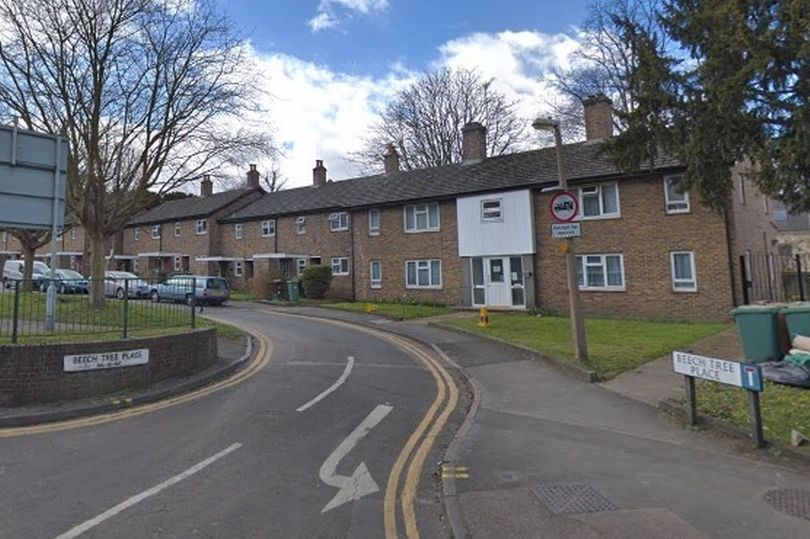
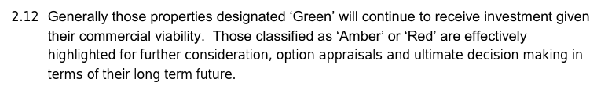

21 homes at Beech Tree Place near Sutton Town centre have been demolished by Sutton Council.

In September 2017, it was [listed](https://moderngov.sutton.gov.uk/documents/s54307/7%20Housing%20Revenue%20Account%20Business%20Plan%20201718%20-%20204647%20-%20Appendix%20A.pdf) as 'amber' in Sutton's [stock investment review](https://moderngov.sutton.gov.uk/documents/s54306/7%20Housing%20Revenue%20Account%20Business%20Plan%20201718%20-%20204647.pdf) which requires an options appraisal on the future of the building before any continued investment in its upkeep:

Beech Tree Place is also listed as a development site in Sutton's Local Plan (Site STC 11).

In November 2018, it was [reported](https://www.croydonadvertiser.co.uk/news/croydon-news/sutton-sheltered-housing-residents-intimidated-2218561) that residents were _'feeling intimidated and anxious'_ as a result of the Council's approach.

In October 2020, Sutton Council [resolved](https://www.sutton.gov.uk/info/200502/housing_advice_and_options/2087/beech_tree_place_regeneration) to pursue the option of full demolition and redevelopment of the site.

The Council has appointed Public Voice Ltd (formerly Strategic Urban Futures (StUF)) to conduct the consultation with residents: 

[https://www.publicvoice.london/neighbourhoods/residents/beech-tree-place/](https://www.publicvoice.london/neighbourhoods/residents/beech-tree-place/)

---

__Links:__  

[Sutton Council's consultation document - https://www.sutton.gov.uk/downloads/file/4565/s105_consultation_document_for_beech_tree_place](https://www.sutton.gov.uk/downloads/file/4565/s105_consultation_document_for_beech_tree_place)

[Sutton Council's web page for the scheme - https://www.sutton.gov.uk/info/200502/housing_advice_and_options/2087/beech_tree_place_regeneration](https://www.sutton.gov.uk/info/200502/housing_advice_and_options/2087/beech_tree_place_regeneration)

---

<!------------THE CODE BELOW RENDERS THE MAP - DO NOT EDIT! ---------------------------->

---