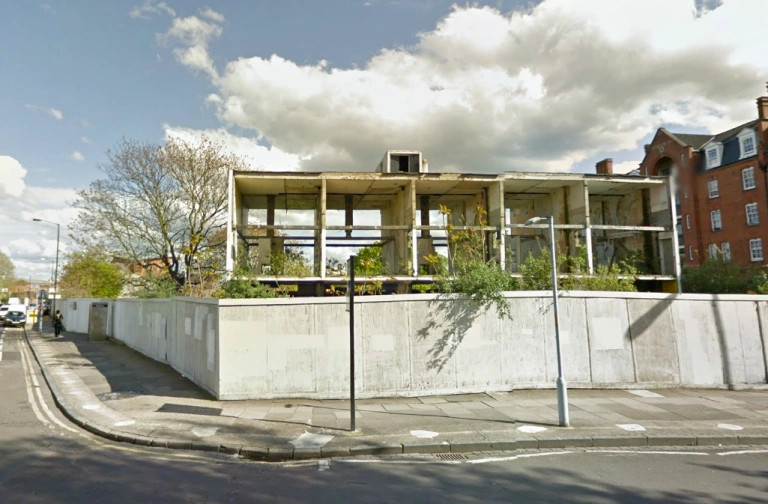

482 homes have been demolished on the Elmington estate in Southwark.
The redevelopment of the estate was completed in 2021.

It has been [reported] that the estate's redevelopment has resulted in the net loss of 346 social rented homes.

---

<!------------THE CODE BELOW RENDERS THE MAP - DO NOT EDIT! ---------------------------->

---