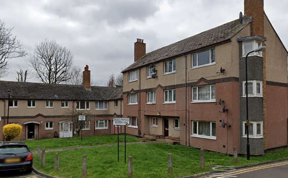

Approximately 120 council homes have been demolished on the Hylands Road regeneration in Walthamstow.

The estate was one of 11 estates [identified](https://democracy.walthamforest.gov.uk/documents/s10654/4.2.%20LSP%20report%20-%20Estates%20Review.pdf) for possible redevelopment in a 2010 Estates Capacity Study.

According to [this April 2019 Cabinet report](https://democracy.walthamforest.gov.uk/ieDecisionDetails.aspx?ID=3213) two of the 50 homes are owned by leaseholders. Planning permission was [approved](https://www.guardian-series.co.uk/news/18085677.plans-knock-hylands-road-council-housing-build-120-new-homes-approved/) in December 2019.

According to the above report, the estate is one of the 'emerging priority estates' earmarked for redevelopment in the Council's 'Estates Capacity Study' carried out by consultants Aecom in 2010 (para 3.3). 

---

<!------------THE CODE BELOW RENDERS THE MAP - DO NOT EDIT! ---------------------------->

---