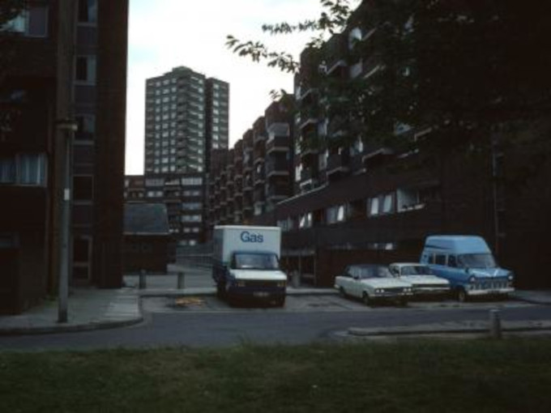

165 homes were demolished on the Leopold estate in Tower Hamlets.
The redevelopment of the estate was completed in 2018.

---

<!------------THE CODE BELOW RENDERS THE MAP - DO NOT EDIT! ---------------------------->

---