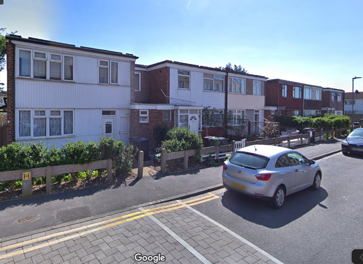
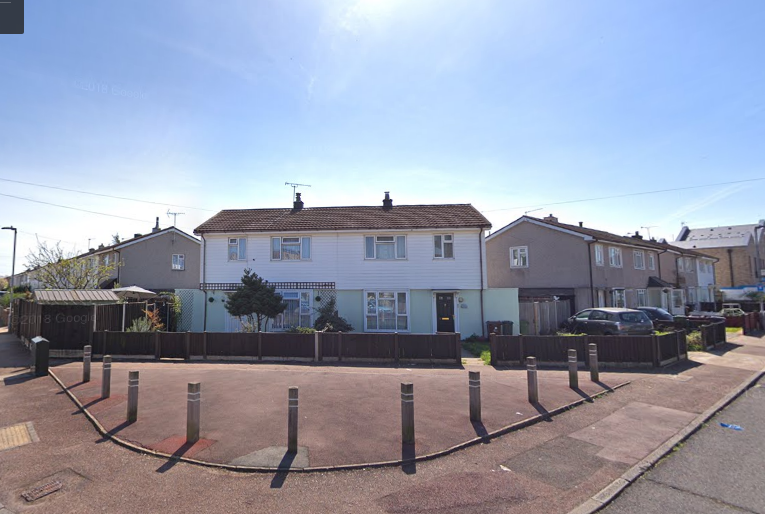
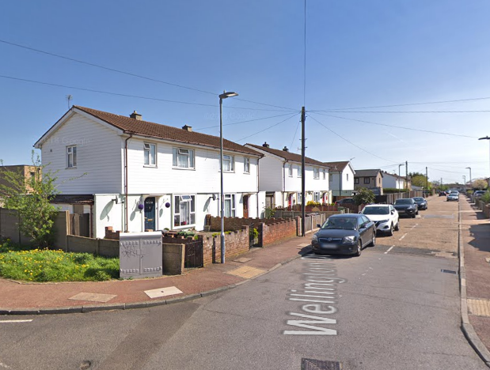
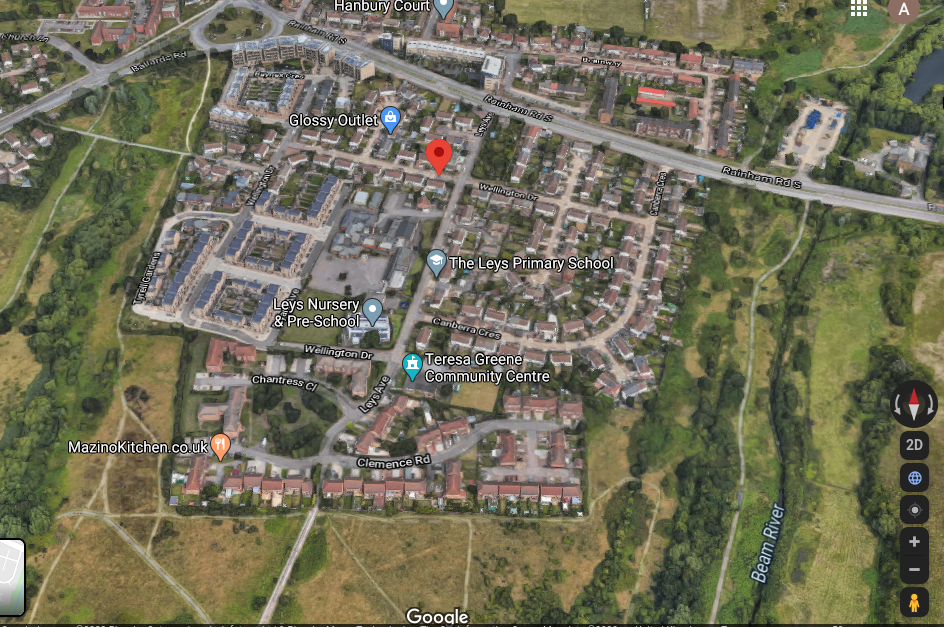

215 homes have been demolished on Barking and Dagenham's Leys estate.

The Leys Estate was located in Dagenham, just south of Rainham Road close to its junction with Ballards Road. The estate is surrounded by parkland and comprises two neighbourhoods - Birdbrook Close (proposed phase 1); and, Wellington Drive (proposed phase 2). The estate is approximately half a mile south of Dagenham East Underground station.

Phase one of the scheme is nearing completion and involved demolition of around 100 of the estates 215 homes in 2015. 
Phase 2 of the scheme is currently being progressed.

The overall redevelopment will provide 158 new homes - all of which at affordable rent (up to 80% market rent) and is being progressed by the Council's subsidiary affordable housing company [Reside](https://www.lbbd.gov.uk/affordable-rents-reside-housing) which provides intermediate rented housing _"to people who are in employment, but can’t afford to buy or rent privately and have limited access to social housing"_

The Council says that tenants wanting to return to the redeveloped site will pay 'social' rents and that current leaseholders will have the 'Right to Return' to the redeveloped estate. But its [rehousing policy](https://modgov.lbbd.gov.uk/Internet/documents/s131918/Estate%20Renewal%20Report.pdf) provides little detail on how this works in practice - it offers an 'equity loan' scheme but it is discretionary and dependent upon the size of the gap between the value of leaseholders' current homes and the new ones proposed to be built. (para 2.9) 

---

__Links:__

[GLA stage 1 and 2 reports](https://www.london.gov.uk/sites/default/files/public%3A//public%3A//PAWS/media_id_230987///the_leys_estate_report.pdf) for the scheme.

---

  
  
  

---

<!------------THE CODE BELOW RENDERS THE MAP - DO NOT EDIT! ---------------------------->

---