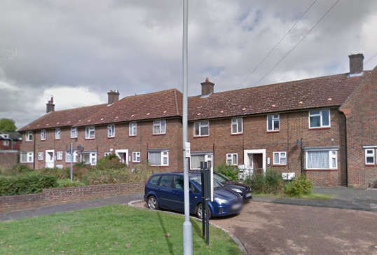
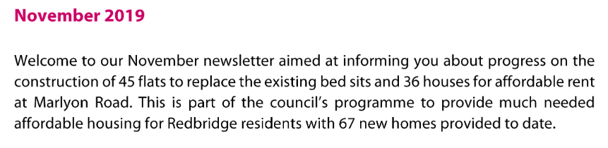
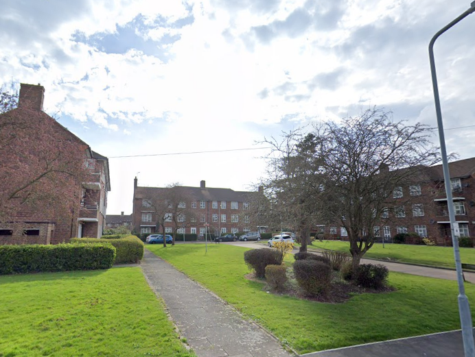

36 homes on Redbridge's Marlyon road estate have been demolished in in a joint venture with Engie Regeneration Ltd. 

A [November 2019 newsletter](https://www.redbridge.gov.uk/media/7409/marlyon-road-newsletter-november-2019.pdf) gives further details of the scheme - and describes the replacement homes as 'affordable rent' tenure (i.e. up to 80% market rent).

---

  
  

---

<!------------THE CODE BELOW RENDERS THE MAP - DO NOT EDIT! ---------------------------->

---