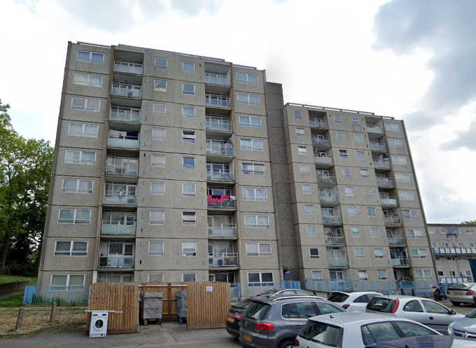
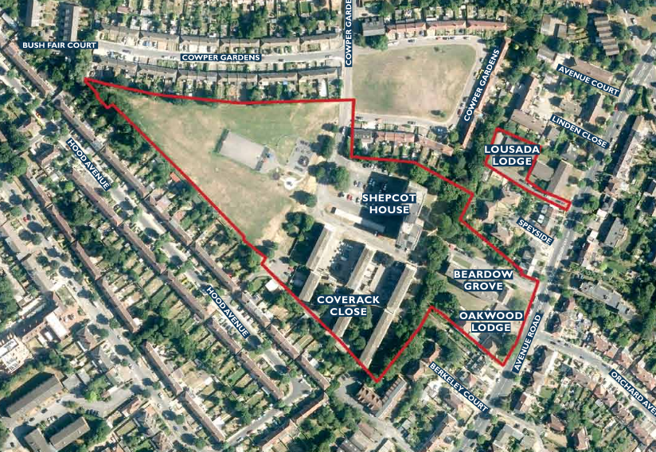
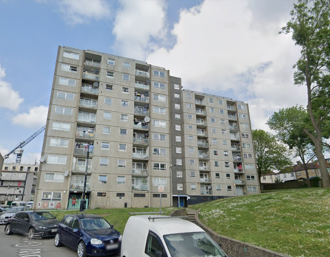

In April 2018, the Mayor approved the demolition of 171 homes on Enfield's New Avenue estate with just 60 replacement properties at social rent.

Enfield Council signed a joint-venture agreement with developer Countryside Properties for the redevelopment of the estate in 2015.

Phase one of the three phase scheme has been demolished and is nearing completion. Remaining phases are still occupied but in the process of beeing 'decanted'.

In December 2017 Enfield [set out its intention](https://estatewatch.london/images/newavenuesr.pdf) to provide just 60 social rented replacement units, the remainder of the 'affordable housing' being for affordable rent (up to 80% market rent) or intermediate affordable.

Despite being funded by the Mayor and exempted from his ballot requirements. In April 2018 the Mayor signed off the planning permission granting the construction of 408 new homes of which only 34% will be 'affordable'. The Mayor's minimum policy requirement is 50% in estate regeneration schemes. The Mayor's report says that it was able to increase the number of social rented homes to 129. But the section 106 agreement is not publicly available on Enfield's planning portal so it is not clear whether these have been secured as social rent or affordable rent (up to 80% market rent).

Countryside have started [marketing](https://www.countrysideproperties.com/all-developments/london/new-avenue) new phase 1 homes off-plan on the redeveloped estate for prices starting at £600k.

There is no provision on the redeveloped estate for the estate's 40 leaseholders. Enfield has no shared equity scheme - if leaseholders want to buy one of the new shared ownership homes they will have to qualify for eligibility and pay rent on the unowned equity.

---

__Links:__

Enfield's [planning application documents](https://planningandbuildingcontrol.enfield.gov.uk/online-applications/applicationDetails.do?activeTab=documents&keyVal=O5KV2MJN04Y00)

The Mayor's [stage 1 and stage 2 reports](https://www.london.gov.uk/sites/default/files/public%3A//public%3A//PAWS/media_id_394835///new_avenue_estate_report.pdf) (April 2018)

---

  
  
  

---

<!------------THE CODE BELOW RENDERS THE MAP - DO NOT EDIT! ---------------------------->

---