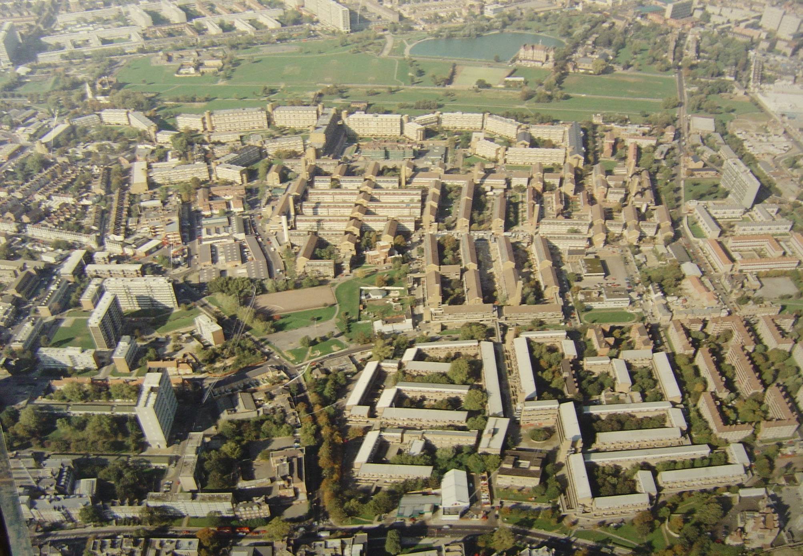

North Peckham estate regeneration was Southwark's first regeneration scheme and was initially put together in the mid 1990's, for the purposes of securing redevelopment funds from the government's Single Regeneration Budget (SRB). It entailed the complete demolition of the 40-acre North Peckham estate of 1,444 council homes and included four adjacent estates, the Sumner, Willowbrook and Gloucester Grove and Camden estates.

According to the GLA's [planning report](https://www.35percent.org/img/five_estates_peckham_report.pdf) for the scheme, a total of 3203 council homes were demolished.

---

<!------------THE CODE BELOW RENDERS THE MAP - DO NOT EDIT! ---------------------------->

---