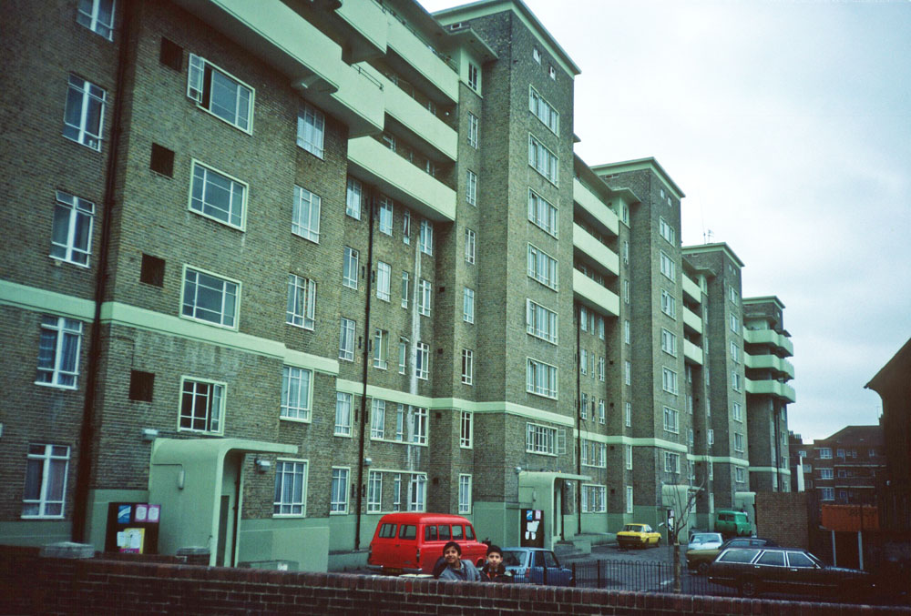

The original Ocean Estate was built after WWII, with additions in 1964. The estate is one of the largest in London and in 2013 there were 7,459 people living in 2,574 households on the estate. The first phase of regeneration started in 1995 with funding from the Single Regeneration Budget (SRB), followed by the New Deal for Communities (NDC) programme in 2000. Both of these programmes saw decanting and demolition of original homes, with the replacement new homes owned and managed by social (not council) landlords. The most recent phases of demolition and rebuild were completed in May 2019, completing all the regeneration and development plans so far.

781 of the estate's homes have been retained with 1,793 demolished in total.

---

 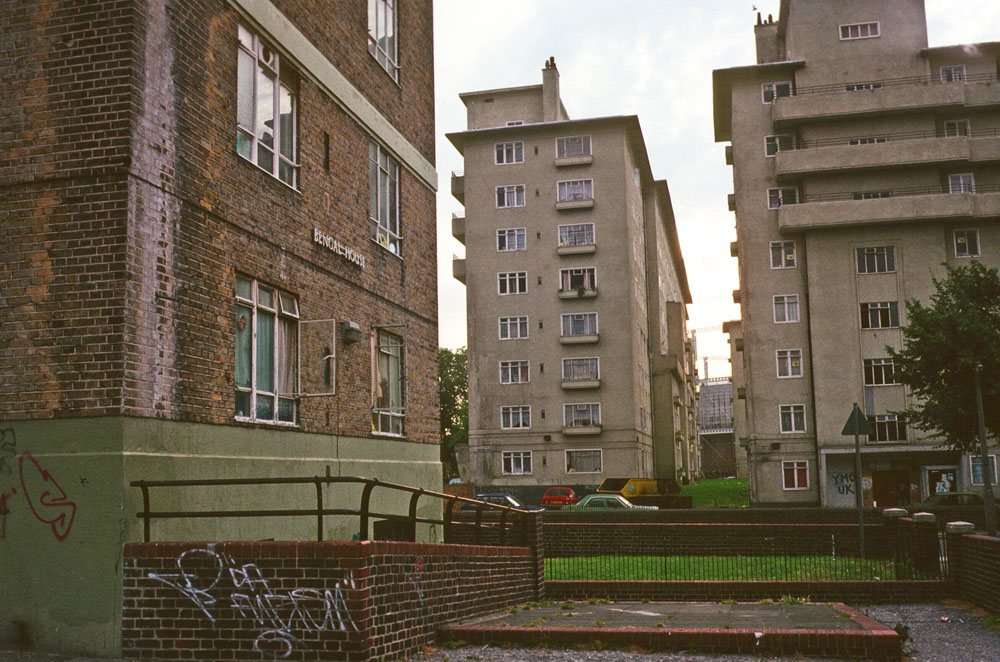
  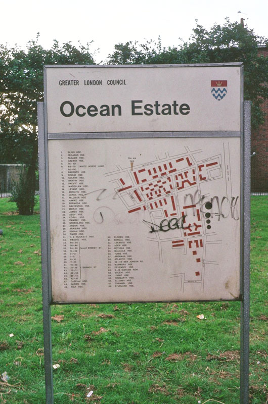
  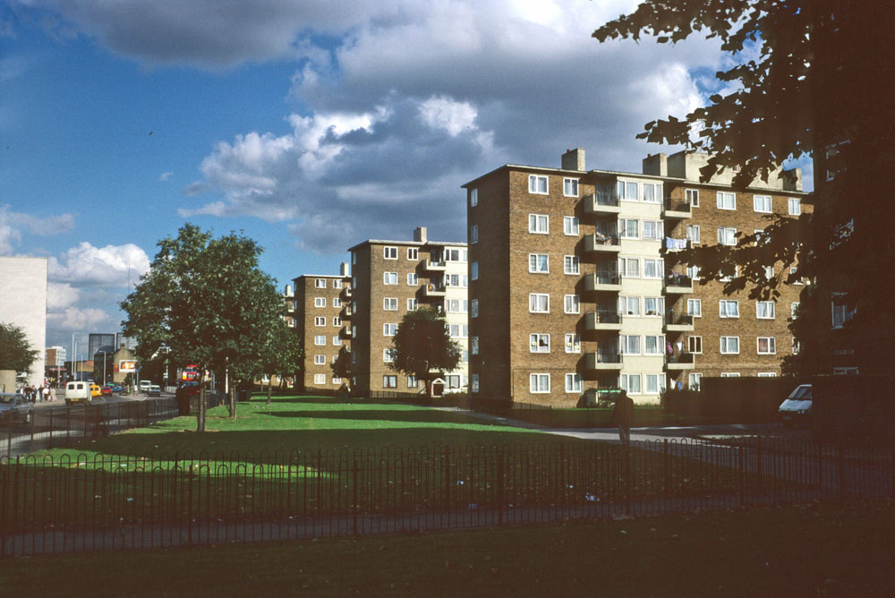
  
  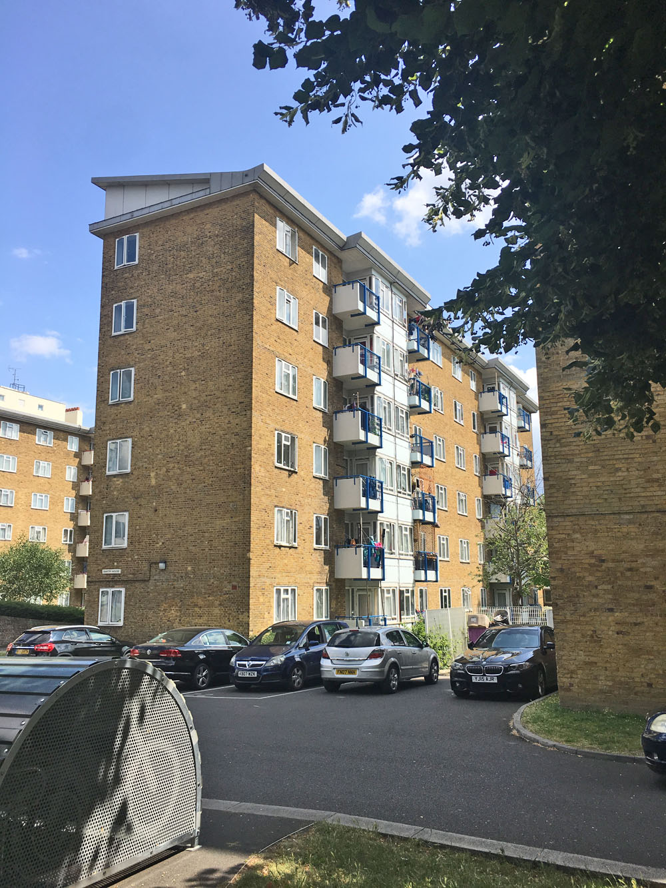
  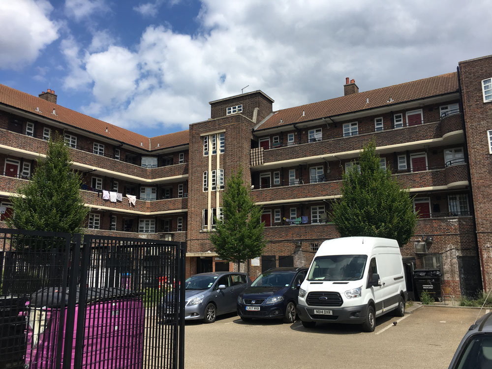
  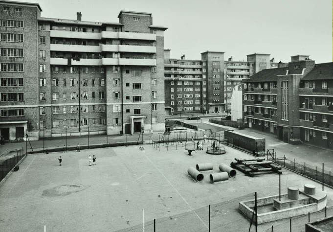
  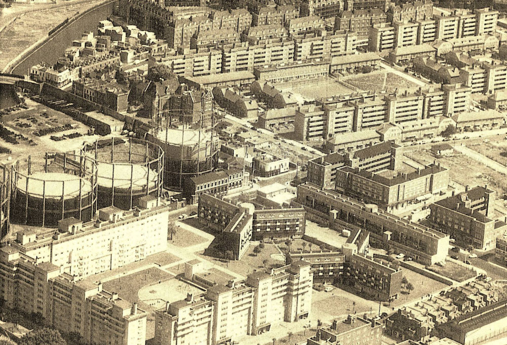
  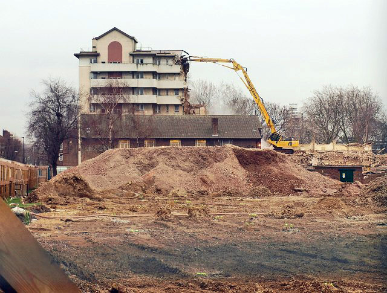
  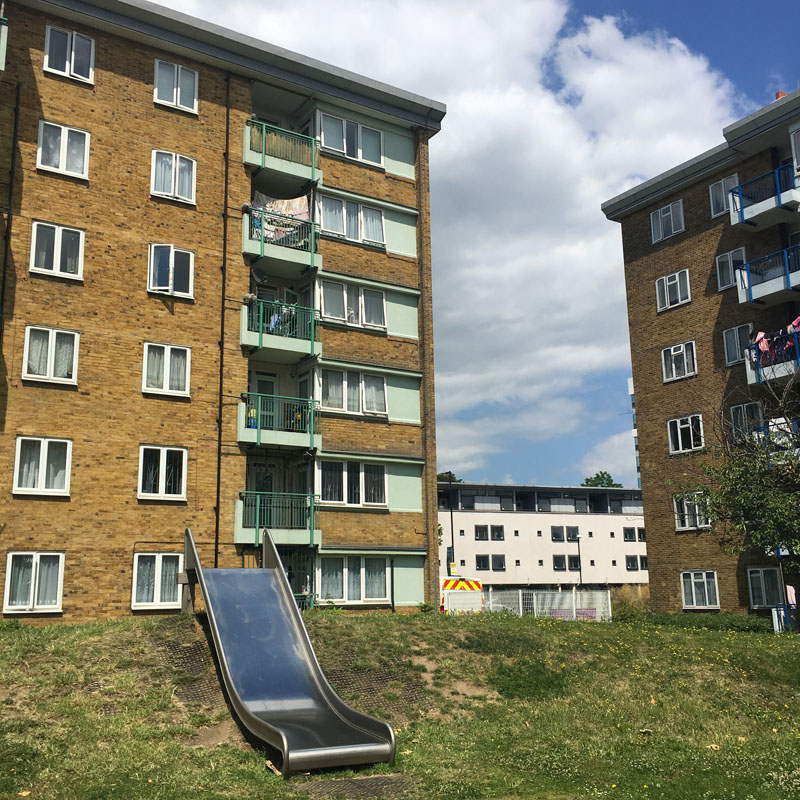
  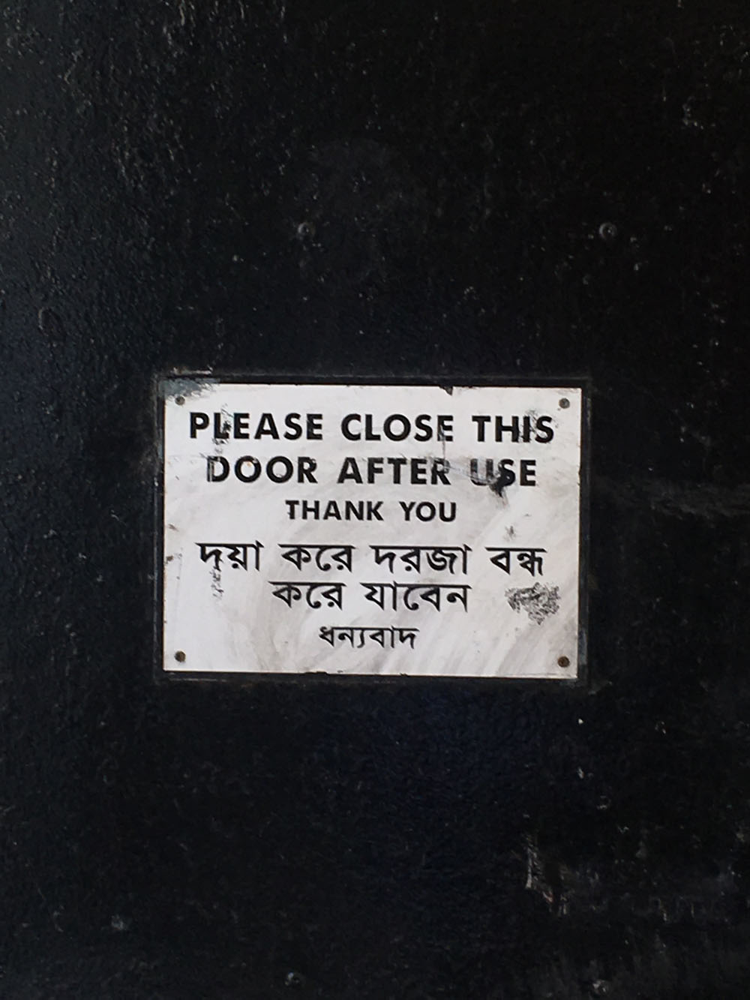
  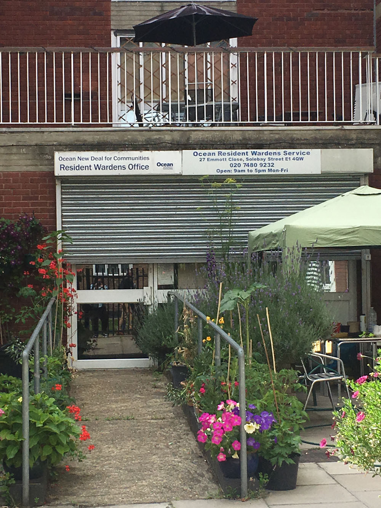
  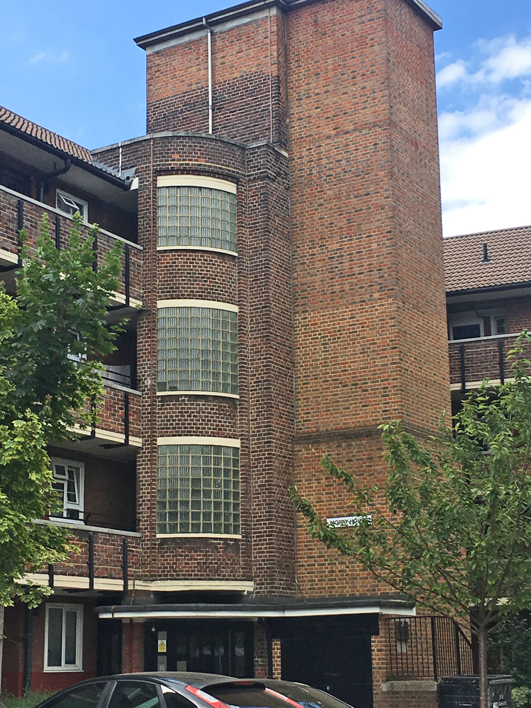
  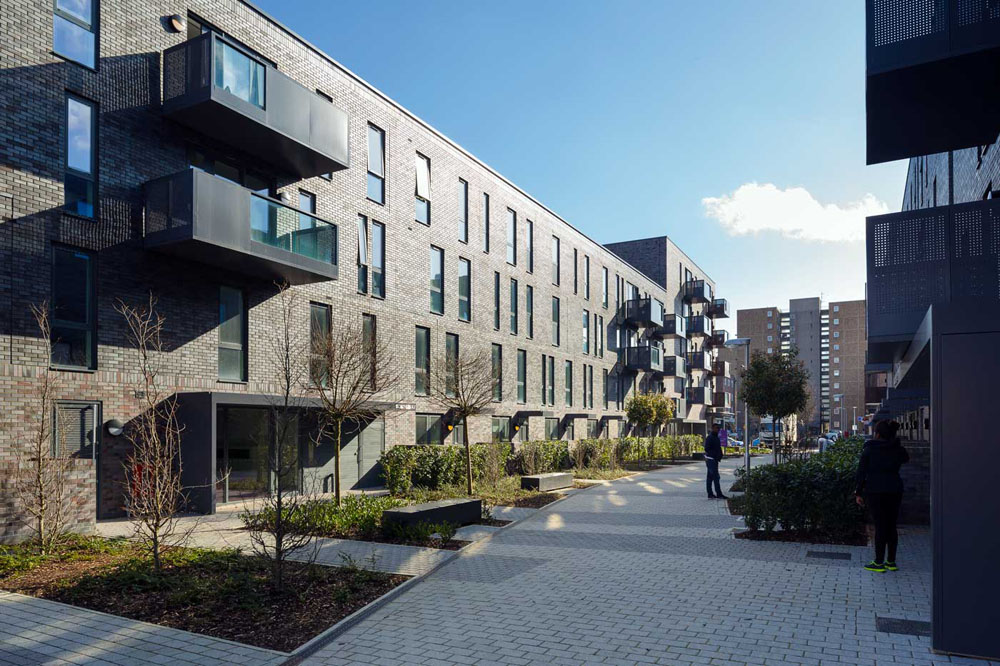
  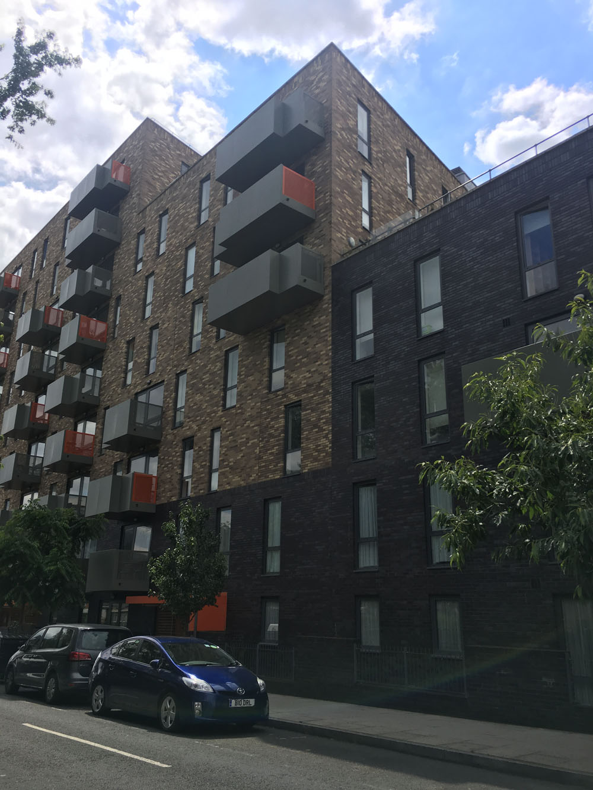
  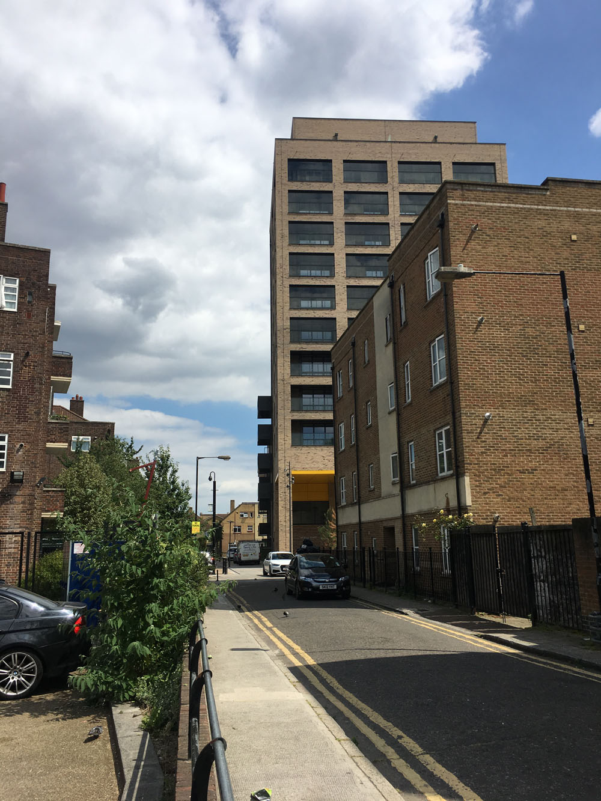
  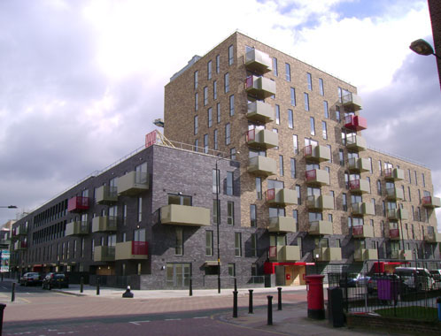

---

<!------------THE CODE BELOW RENDERS THE MAP - DO NOT EDIT! ---------------------------->

---