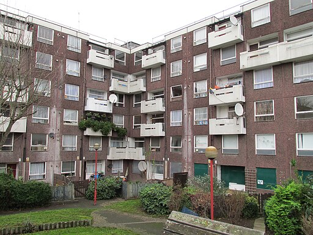

The redevelopment of the Packington estate commenced in 2007 and was completed in 2019.

790 homes have been built on the new estate. These include 300 for private sale and 490 for social rent, meaning the refurbishment has resulted in the loss of 48 social rented homes.

The scheme received an upfront government grant of £33m, which paid outright for the social housing in the first phase.

Read more about the redevelopment of the Packington estate here:

[https://www.insidehousing.co.uk/insight/packington-estate-is-this-the-model-for-regeneration-61670](https://www.insidehousing.co.uk/insight/packington-estate-is-this-the-model-for-regeneration-61670)

---

<!------------THE CODE BELOW RENDERS THE MAP - DO NOT EDIT! ---------------------------->

---