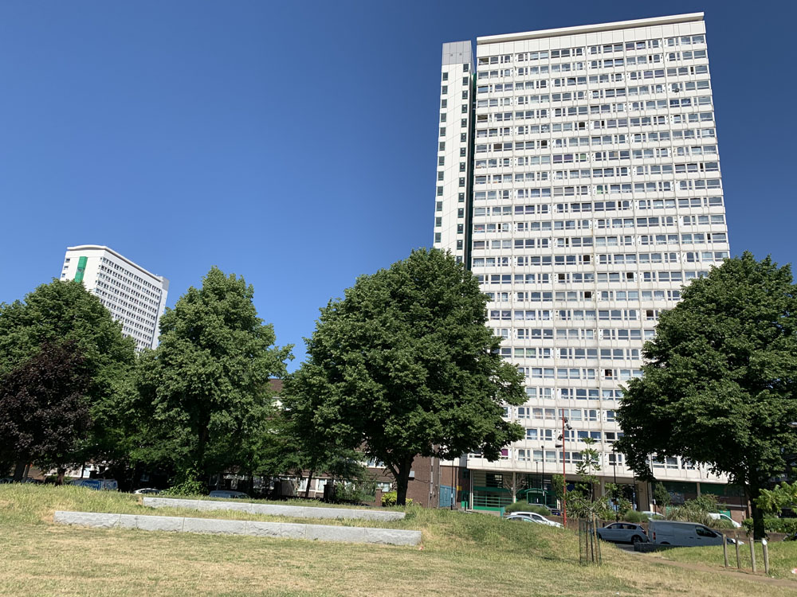

Completed in 1973, Pepys Estate originally had 1,324 homes across three 24-storey tower blocks and ten 8-storey blocks. The estate has seen several different programmes of funding for its regeneration, including Estate Action funding in the 1990s. In 2002, five of the mid-rise housing blocks on the estate were demolished and replaced with seven housing blocks managed by a social landlord. Completed in 2008, this scheme was criticised for not consulting residents and for the displacement of 222 council tenants from the original buildings who were not offered the right to return. Additionally, the estate lost council homes due to the sale of one of its tallest housing blocks (Aragon Tower) in 2002 to a private developer.

---

  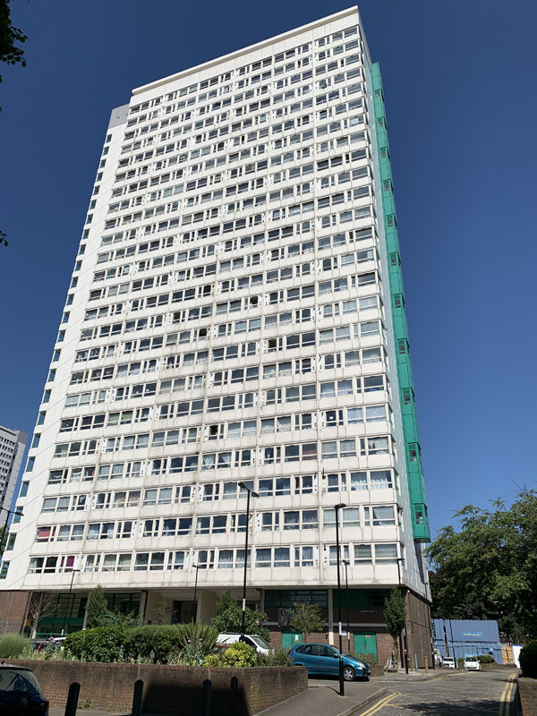
  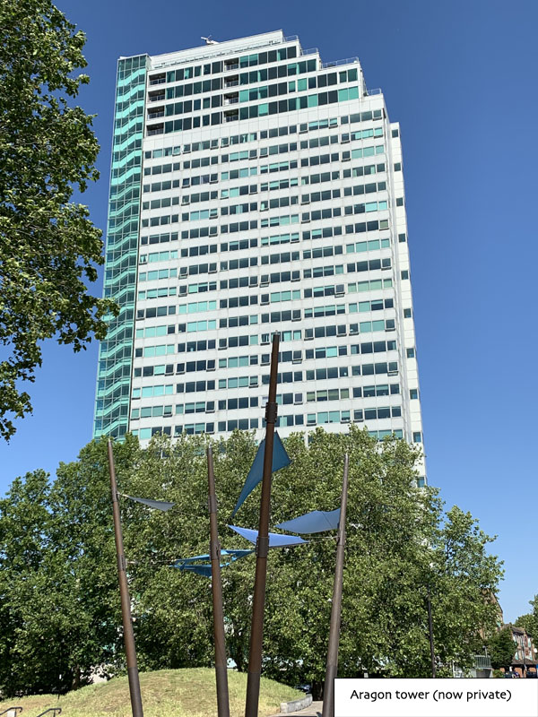
  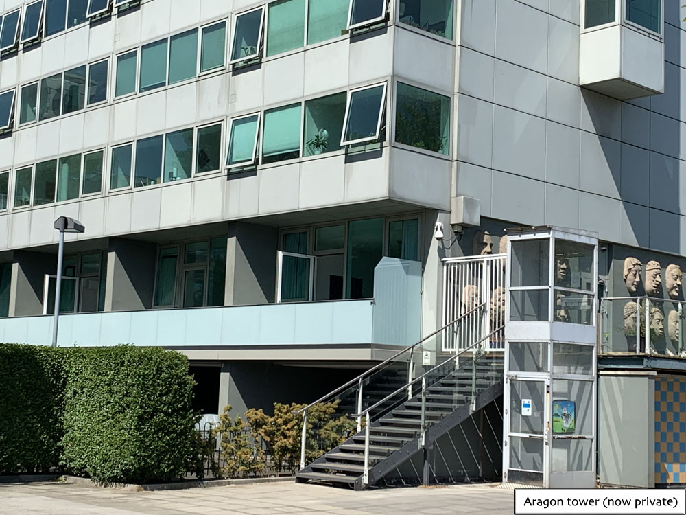
  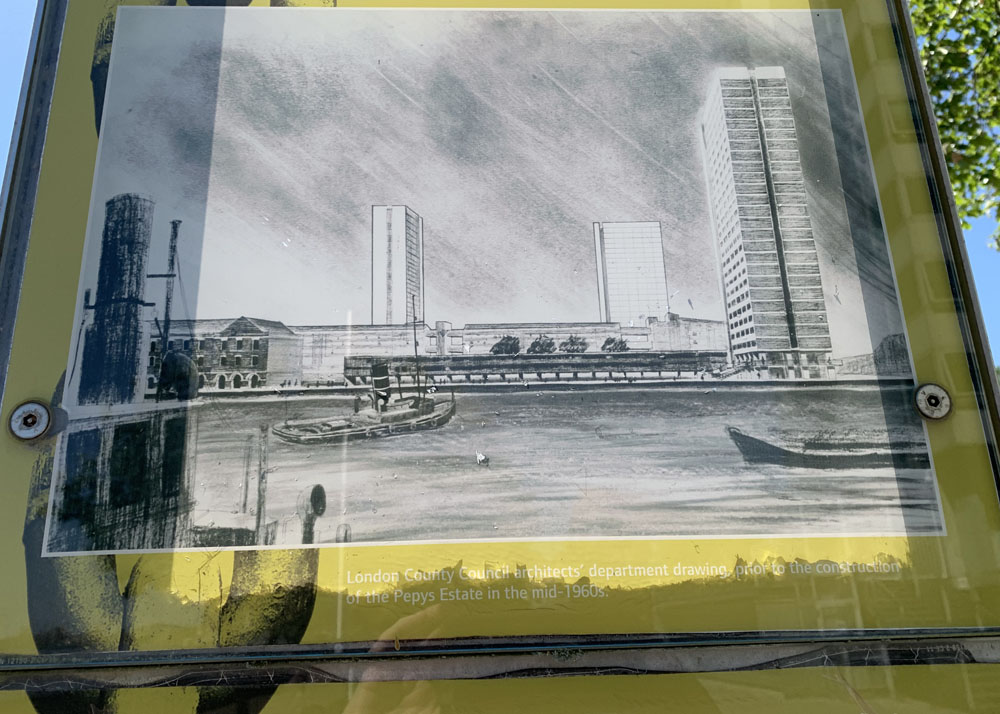
  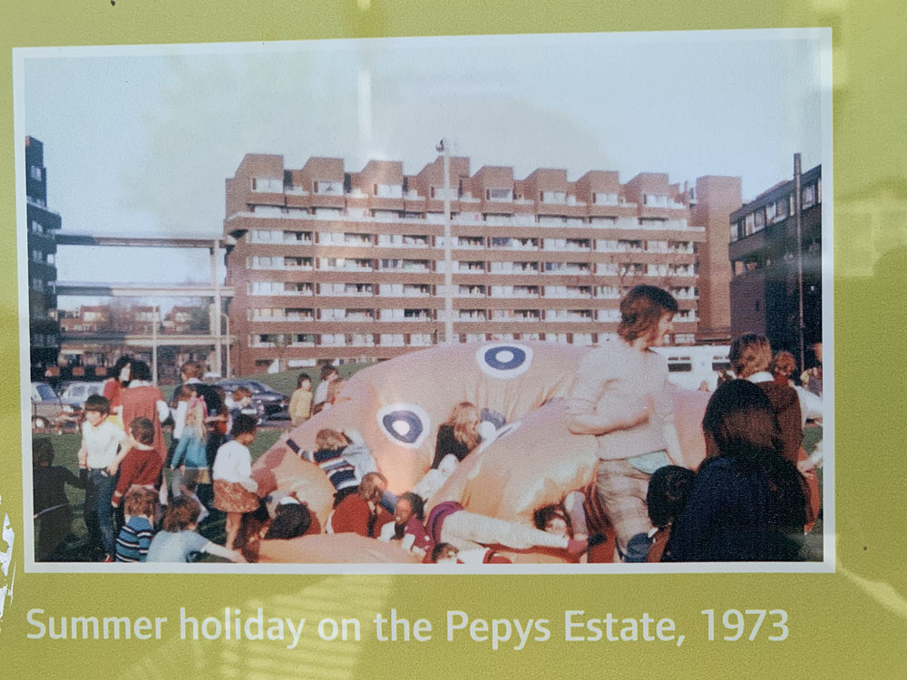
  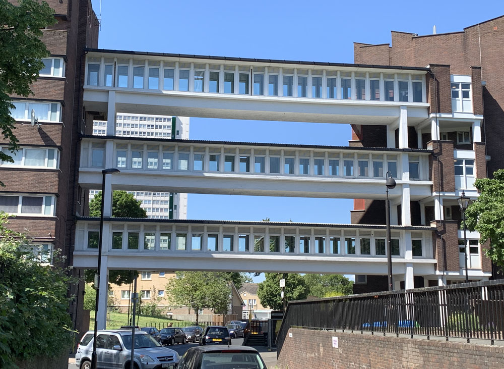
  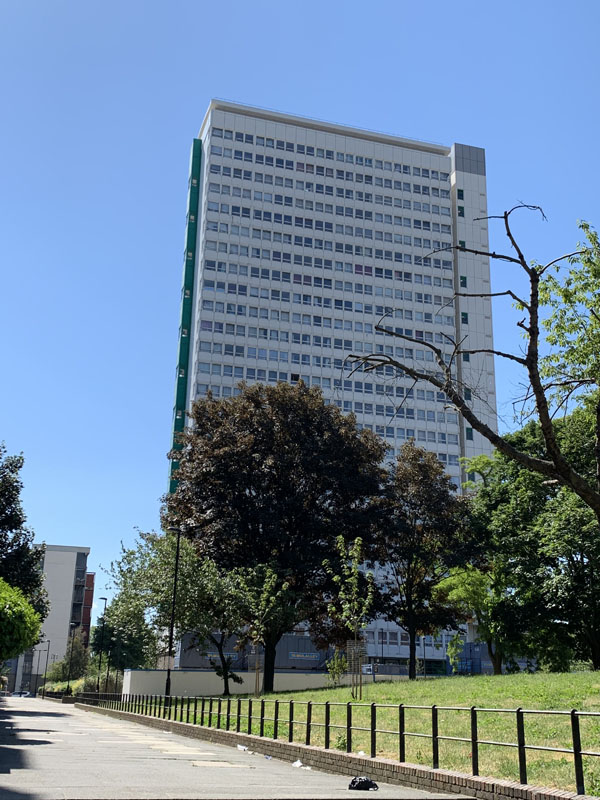
  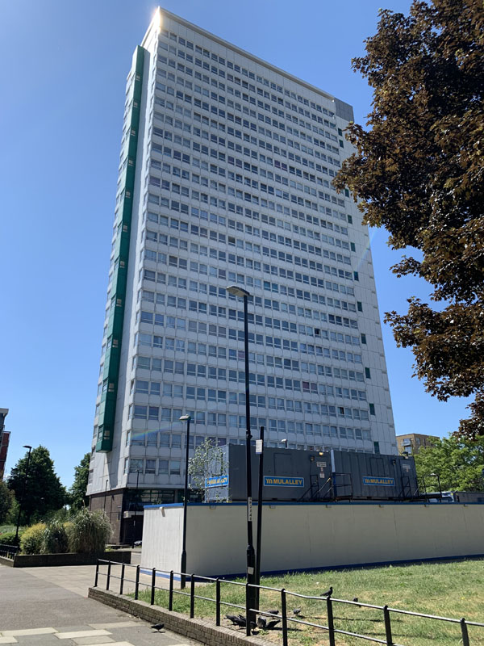
  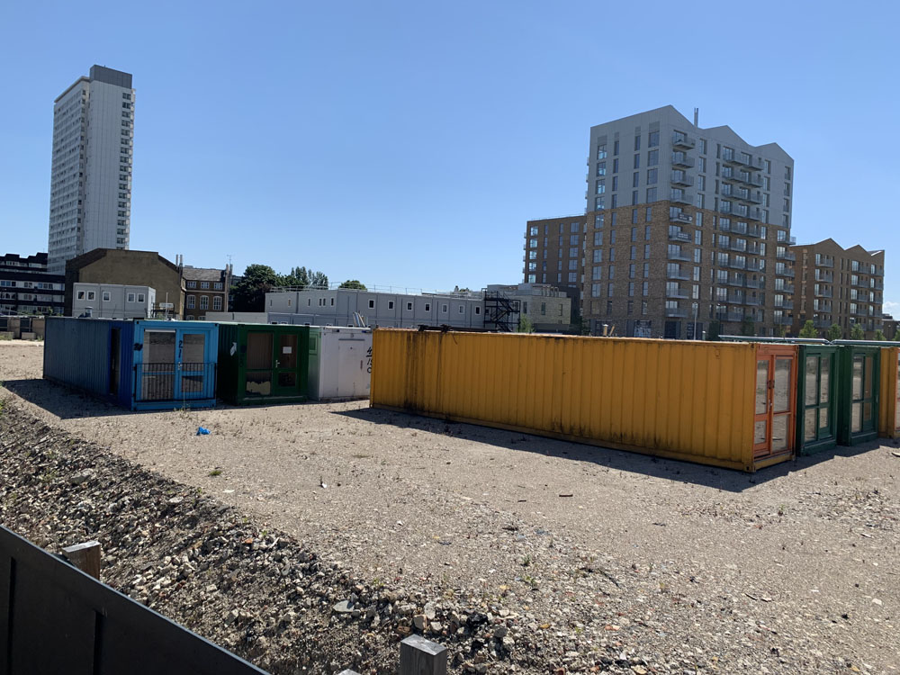
  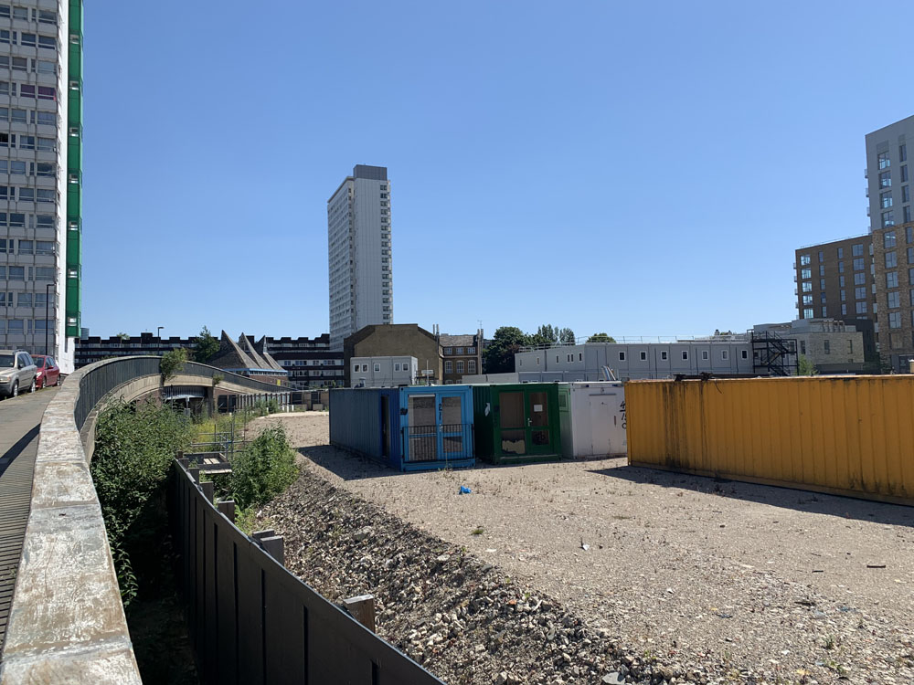
  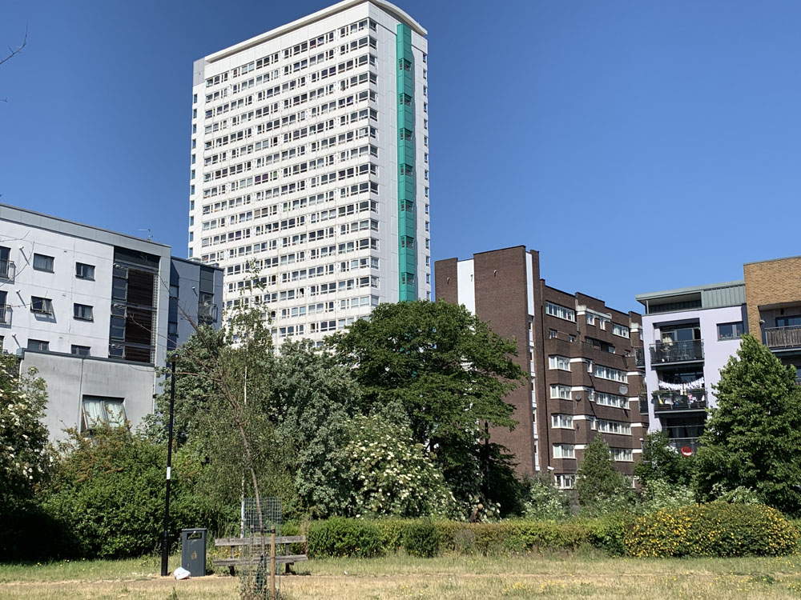
  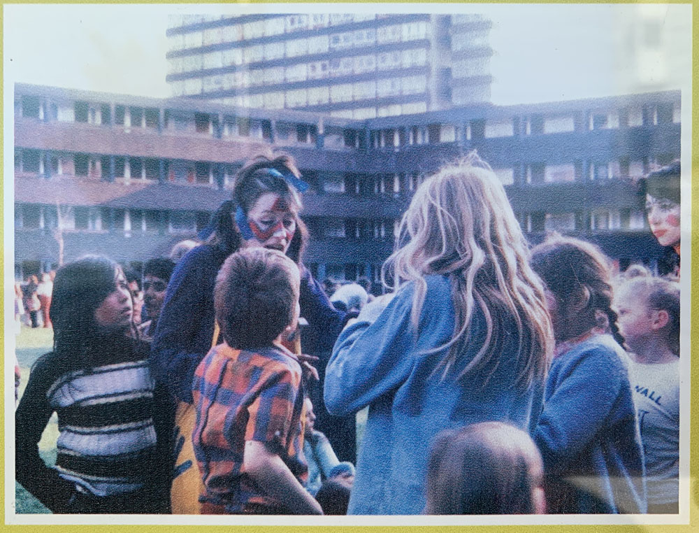
  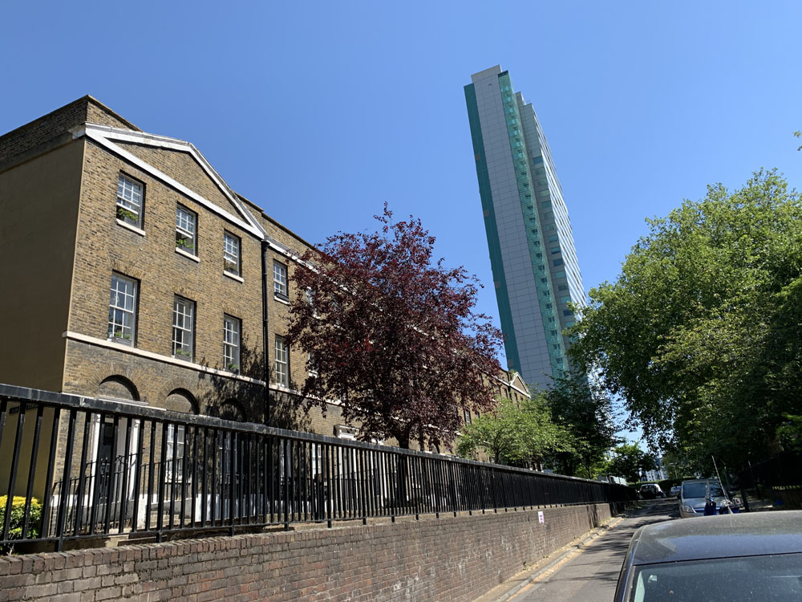
  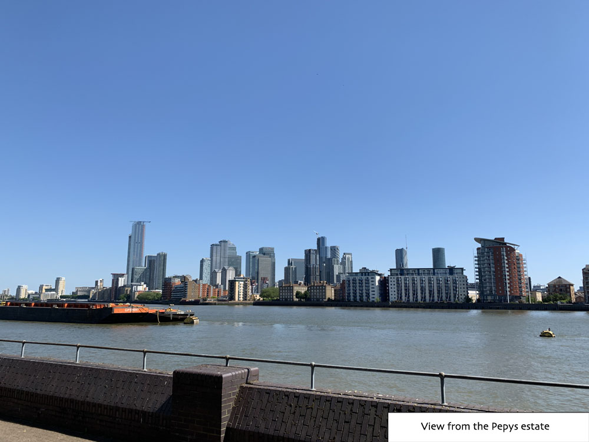

---

<!------------THE CODE BELOW RENDERS THE MAP - DO NOT EDIT! ---------------------------->

---