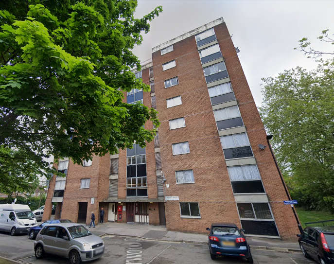
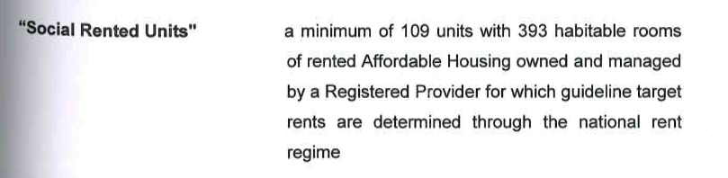
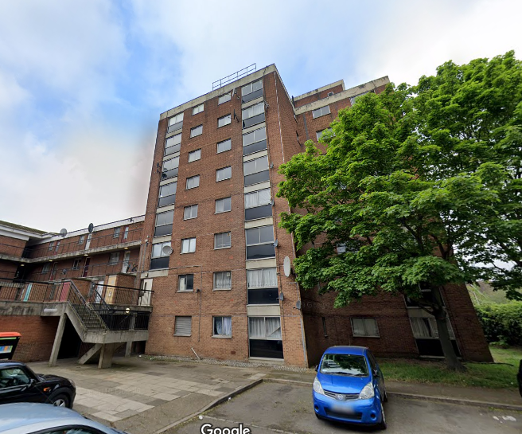
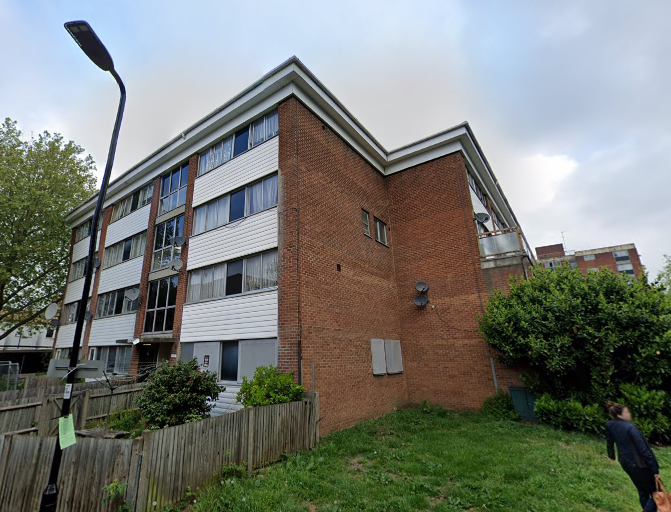

209 homes on Ealing's Sherwood Close estate have been demolished in a joint venture with Clarion housing association.

The scheme is being [funded](/approved/funding) by the Mayor and has been [exempted](/approved/ballotexemptions) from his requirement to ballot residents on the demolition of their homes.

Planning consent was granted in 2015 and while phase one of the scheme has recently been completed, phase two is still under construction. The third and final phase is due to start decanting in early 2020.

Clarion [says](http://www.clarionhg.com/development/regeneration/sherwood-close/) that _"298 homes will be built at Sherwood Close, including 184 homes for market sale and 114 for affordable home ownership/rent."_ and _"Every resident will have the right to return to the estate, as well as advice and assistance if they seek a new form of tenure."_

The [section 106 agreement](https://pam.ealing.gov.uk/online-applications/files/76D78493A9D9E7F9ACABB67832AC8A26/pdf/P_2014_6383-S106_LEGAL_AGREEMENT-2274839.pdf) for the scheme secures 109 social rented homes - this will result in a net loss of 100 social rented homes.

__Links:__  
Mayor's Stage 1 and Stage 2 planning reports - [https://gla.force.com/pr/s/pr-search-results?search=eyJrZXl3b3JkcyI6InNoZXJ3b29kIGNsb3NlIiwiY2F0ZWdvcnkiOiJQQXBwcyIsInR5cGUiOiJzb3NsIiwidXJsIjoiaHR0cHM6Ly9nbGEuZm9yY2UuY29tL3ByL3MvIn0](https://gla.force.com/pr/s/pr-search-results?search=eyJrZXl3b3JkcyI6InNoZXJ3b29kIGNsb3NlIiwiY2F0ZWdvcnkiOiJQQXBwcyIsInR5cGUiOiJzb3NsIiwidXJsIjoiaHR0cHM6Ly9nbGEuZm9yY2UuY29tL3ByL3MvIn0)

---

 

---

<!------------THE CODE BELOW RENDERS THE MAP - DO NOT EDIT! ---------------------------->

---