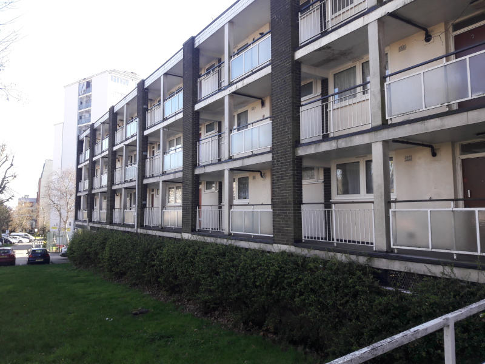
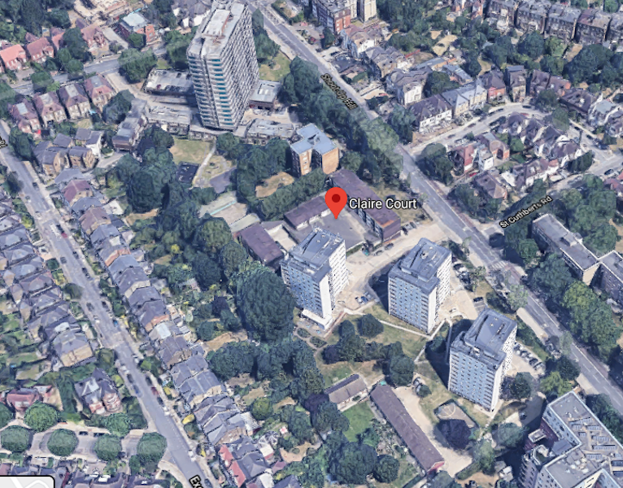
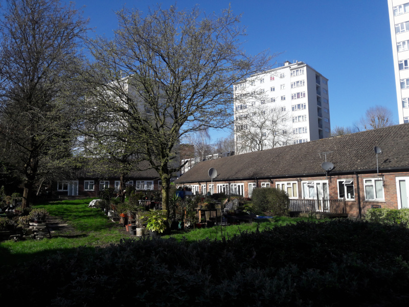
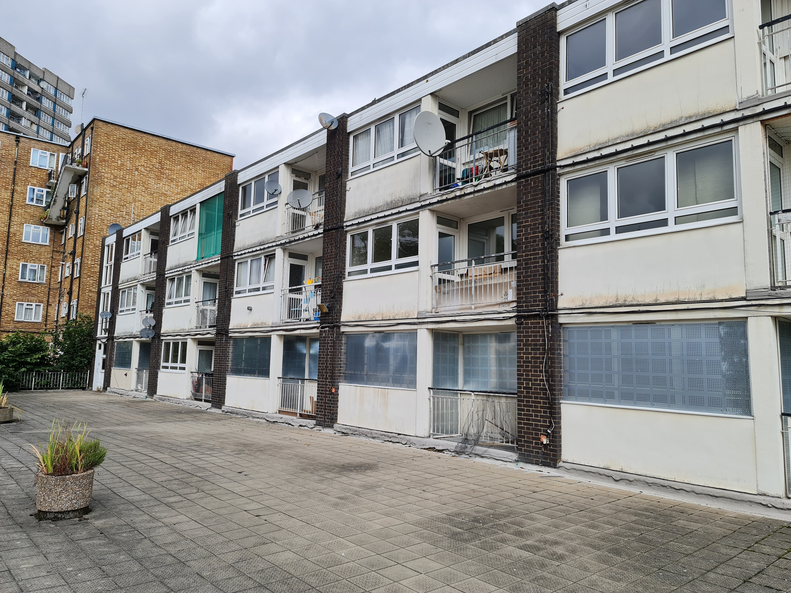
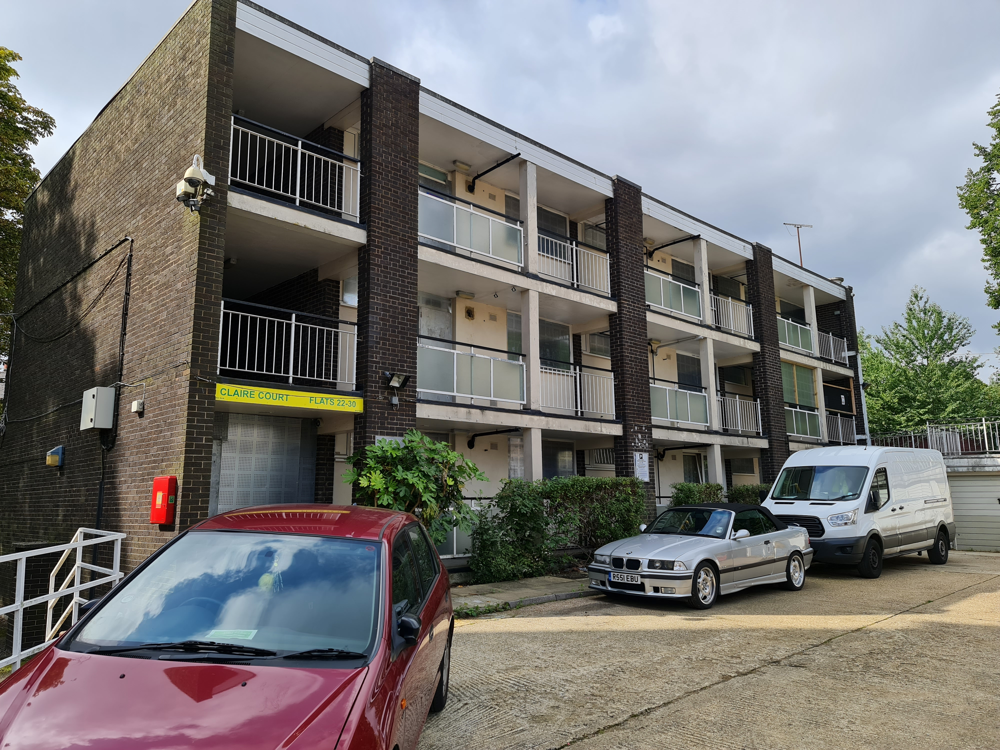
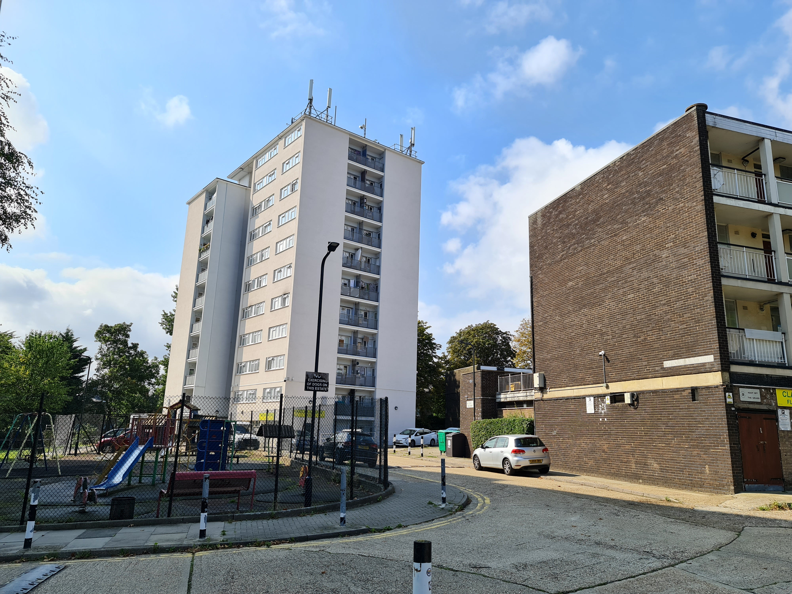
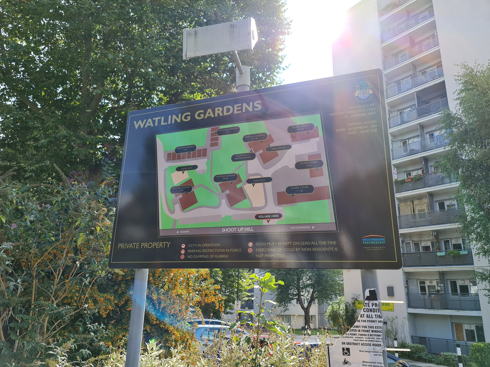
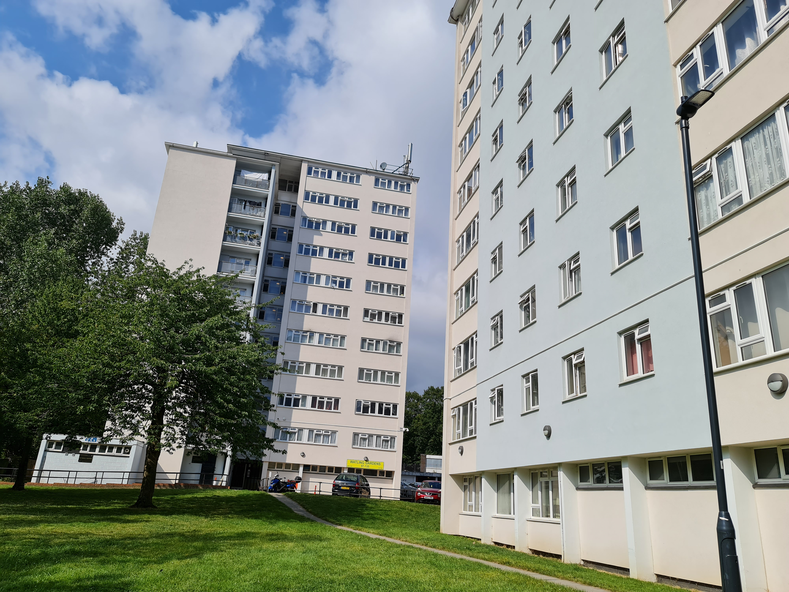
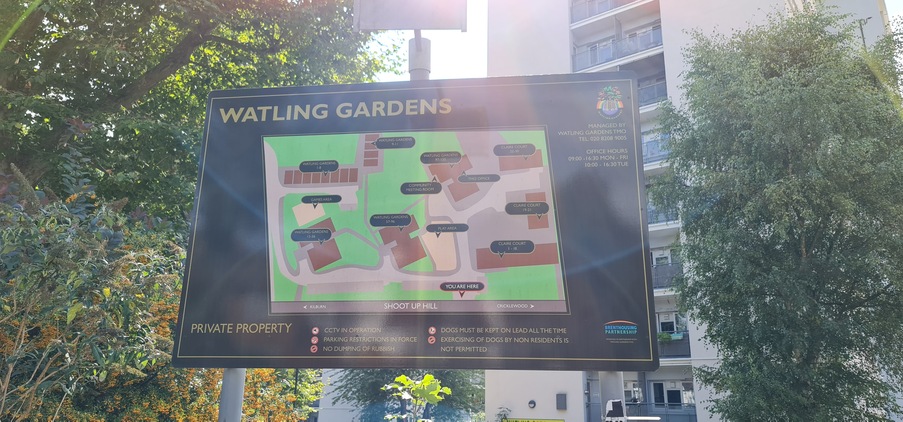

42 homes have been demolished on Brent's Watling Gardens estate in Kilburn.

Brent's cabinet signed off a co-operational agreement with housing association Network Homes on March 9 2020, which will allow the two bodies to share knowledge to improve the borough's housing sector through regeneration schemes.

Three of the schemes are [listed](http://democracy.brent.gov.uk/documents/s95738/07.%20Cabinet%20Report%20-%20Collaboration%20with%20Network%20Homes.pdf) (para 4.4.3) as 'Claire Court, Watling Gardens and Windmill Court' on the Shoot Up Hill road near Kilburn station. 

Two sets of three-storey maisonettes 'Claire Court' have been earmarked for redevelopment as well as a row of bungalows at Watling Gardens and car parking area at Windmill Court. 

In March 2022 a site visit showed that it looked like supported housing and a community space have been boarded up ready for demolition. Behind these are allotments which can no longer be accessed.   

The estate is managed by a Tenant Management Organisation - [Watling Gardens TMO.](http://www.watlinggardenstmo.co.uk/), which has an office on the estate.

---

  
  
  
  
  
  
  
  
  
  
  

Photo credits: Luka Zumbach

---

<!------------THE CODE BELOW RENDERS THE MAP - DO NOT EDIT! ---------------------------->

---