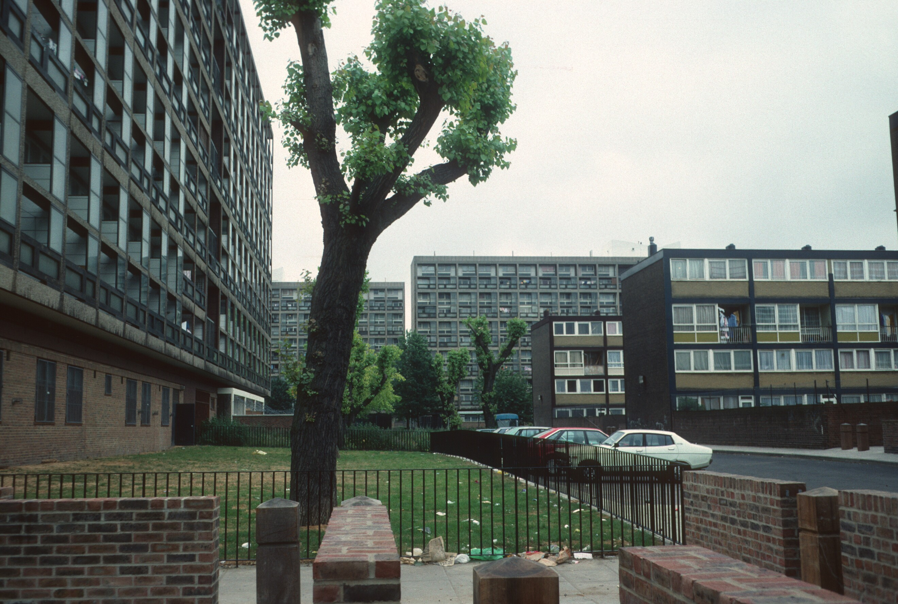

Most of the Silwood estate used to lie in Lewisham, the rest of the estate used to be situated in Southwark before it was knocked down in 2012.

Southwark's half of the estate comprising 95 council homes in Gillam House, 11-33 Debnams Rd and a council depot, was split into two phases; 4A and 4B. These completed in 2017.