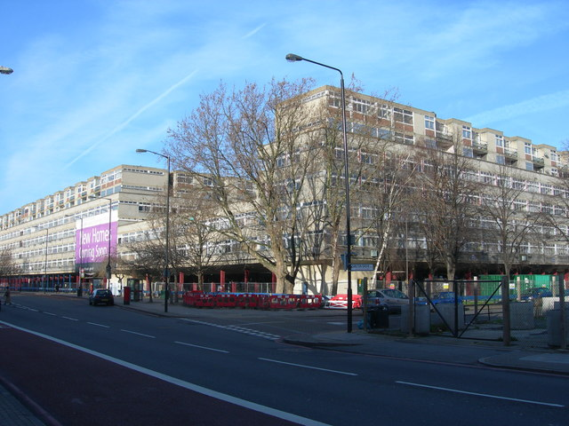

The Wood Dene estate was demolished as part of the ['Southwark Estates Initiative'](https://embed.verite.co/timeline/?source=0Aprl6XcACewydEhRaWFOLVBfUjBSVW1HUGVZNEhGeFE&font=Bevan-PotanoSans&maptype=toner&lang=en&hash_bookmark=true&start_zoom_adjust=2&height=650#1), a regeneration strategy devised by Southwark's Labour administration as part of New Labour's 'Urban Task Force' urban renewal strategy. 

[This May 2005 council report](https://moderngov.southwark.gov.uk/Data/Executive/20050523/Agenda/Item%2011%20-%20Wooddene%20EstateRegeneration%20-%20Update.pdf) confirms that 'Presentation' housing association was selected as the council's development partner in early 2002, to take forward the redevelopment of the Wood Dene estate. 

The report confirms that there were 16 leaseholders and 5 'live' Right to Buy applications at the time the report was drafted. The estate comprised 323 homes in total.

Planning application [documents](https://moderngov.southwark.gov.uk/documents/s38968/Report.pdf) confirm that the Wood Dene estate comprised 323 council homes within two interlocking blocks, of which 7 were council leaseholders. The estate was demolished in 2007. 

[Land Registry deeds](https://crappistmartin.github.io/images/LRegisterWoodDene.pdf) show that the Council sold the entire Wood Dene site to Notting Hill for just £7m. 

The scheme was eventually completed in 2021 after a long delay. The hoarding notice on the site says that the 54 replacement 'social' homes will be 'affordable rent' (i.e. up to 80% market rent).