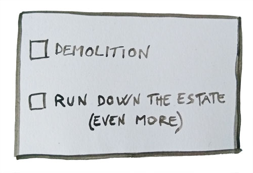
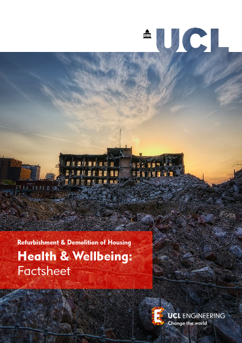
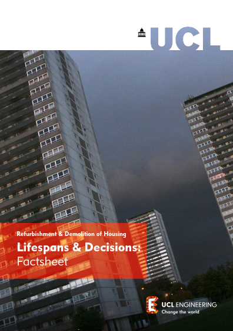



The negative social and environmental impacts of demolishing social housing estates are becoming increasingly evident. 

We are campaigning for the Mayor to introduce a policy presumption against redevelopment such that demolition should only be allowed in exceptional circumstances. See our [Alternative Good Practice Guide](../alternative-good-practice-guide-to-estate-regeneration.pdf) for further details. 



<b>What is wrong with redeveloping London's housing estates?</b>

1. Despite best intentions, replacement 'affordable' housing invariably ends up in a loss of social rented housing and/or [higher rents](https://www.pilc.org.uk/news/affordable-housing-increases-rents-for-low-income-londoners/). 

2. Schemes are routinely delayed and subject to value engineering or landbanking by developers. Housing waiting lists are impacted and long-standing communities suffer uncertainty, disruption and displacement.

3. Structurally sound homes are needlessly demolished and replaced, creating significant uneccessary carbon emissions that further exacerbate climate change.

---



<b>Maintenance costs on aging housing estates are a burden, isn't it more cost effective to replace them?</b>

> Despite their age and lack of investment, evidence shows that most estates actually provide a surplus when rental income is compared to maintenance costs. See [here](https://x.com/NunheadTRA/status/1667809201882636288) for some examples. 

---



<b>But new private housing cross-subsidises the replacement social housing doesn't it?</b>

> Despite best intentions, developers' profit margins and the [viability testing loopholes](https://www.theguardian.com/cities/2015/jun/25/london-developers-viability-planning-affordable-social-housing-regeneration-oliver-wainwright) mean that the cost of replacement social housing and demolition/rehousing ends up being subsidised mainly by local authorities, grant funding or by reducing the quantum and affordability of replacement social housing. See [here](https://www.paywallskip.com/article?url=https%3A%2F%2Fwww.insidehousing.co.uk%2Fnews%2Festate-regenerations-failed-to-replace-social-homes-due-to-cross-subsidy-model-nhf-boss-says-88513) and [here](https://www.pilc.org.uk/wp-content/uploads/2024/09/The-promise-of-cross-subsidy_FULL-REPORT.pdf) for evidence of this. 

---



<b>What if the majority of residents vote for demolition, shouldn't their wishes be respected?</b>

> There are a number of problems with the current ballot process. Not least the fact that refurbishment is never an option on the ballot paper. Read our full review of the flaws in the ballot process [here](/ballots/).

---



<b>London needs more homes, why shouldn't estates be rebuilt with increased density to house existing residents and also increase overall housing stock? </b>

> There are plenty of large brownfield sites in London that have stood empty for decades, having been land-banked by developers. It would be more effective to bring these forward for development before knocking down existing housing.

> Many estates earmarked for demolition are already high density. They tend to be selected not on their propensity to increase density but rather on architectural fashions (grey, concrete, 'monolithic' etc).

> In general, redeveloped estates do provide more homes in total but they tend to be smaller (1 & 2 bed, rather than the family size homes they are often replacing). See the Aylesbury estate for example. 

> Studies have shown that in-fill development on estates can be more effective in increasing density than wholescale redevelopment. See the [St Raphael's estate](https://www.brent.gov.uk/housing/new-council-homes/where-we-are-building/st-raphaels-estate/about), the [Alton estate](/estates/altonarea/) and the [West Ken and Gibbs estate](https://westkengibbsgreen.wordpress.com/neighbourhood-plan-2021/) for examples of these.

---

## Making the case for refurbishment
 The [Engineering Exchange at UCL](https://www.ucl.ac.uk/engineering-exchange/) have produced a series of factsheets, videos and a peer-reviewed report, which show that refurbishment is the better option socially and environmentally.

 |    |          |   |
|----------|:-------------|------:|
|  |  [Demolition or refurbishment of social housing - a review of the evidence](../https://www.ucl.ac.uk/engineering-exchange/sites/engineering-exchange/files/report-refurbishment-demolition-social-housing_1.pdf) |
|  |  [Embodied Carbon: Factsheet](https://www.ucl.ac.uk/engineering-exchange/sites/engineering-exchange/files/fact-sheet-embodied-carbon-social-housing.pdf)   |
|  | [Health and Well-being: Factsheet](https://www.ucl.ac.uk/engineering-exchange/sites/engineering-exchange/files/fact-sheet-health-and-wellbeing-social-housing.pdf) |
|  | [Lifespans and Decisions: Factsheet](https://www.ucl.ac.uk/engineering-exchange/sites/engineering-exchange/files/fact-sheet-lifespan-and-decisions-social-housing.pdf) |
|  | [Policy Briefing: Making decisions on demolition or refurbishment of social housing](https://www.ucl.ac.uk/engineering-exchange/sites/engineering-exchange/files/policy_brief_refurbishment_and_demolition_of_social_housing.pdf)  |
|  | [Refurbishment and Demolition: Community Toolkit](https://www.ucl.ac.uk/engineering-exchange/sites/engineering-exchange/files/ucl150_a4-demolition-toolkit_v4_online.pdf)  |

<iframe width="100%" height="315" src="https://www.youtube.com/embed/jFo_aFlg41Y?si=hI3fy1e0dJBFLwbz" title="YouTube video player" frameborder="0" allow="accelerometer; autoplay; clipboard-write; encrypted-media; gyroscope; picture-in-picture; web-share" referrerpolicy="strict-origin-when-cross-origin" allowfullscreen></iframe>

<iframe width="100%" height="315" src="https://www.youtube.com/embed/VwO5lyUiZpc?si=R-XQMe2FVTSXUQaA" title="YouTube video player" frameborder="0" allow="accelerometer; autoplay; clipboard-write; encrypted-media; gyroscope; picture-in-picture; web-share" referrerpolicy="strict-origin-when-cross-origin" allowfullscreen></iframe>

<iframe width="100%" height="315" src="https://www.youtube.com/embed/A1OaRsFgg-E?si=E8rZ_b6wJ9-umqDB" title="YouTube video player" frameborder="0" allow="accelerometer; autoplay; clipboard-write; encrypted-media; gyroscope; picture-in-picture; web-share" referrerpolicy="strict-origin-when-cross-origin" allowfullscreen></iframe>

